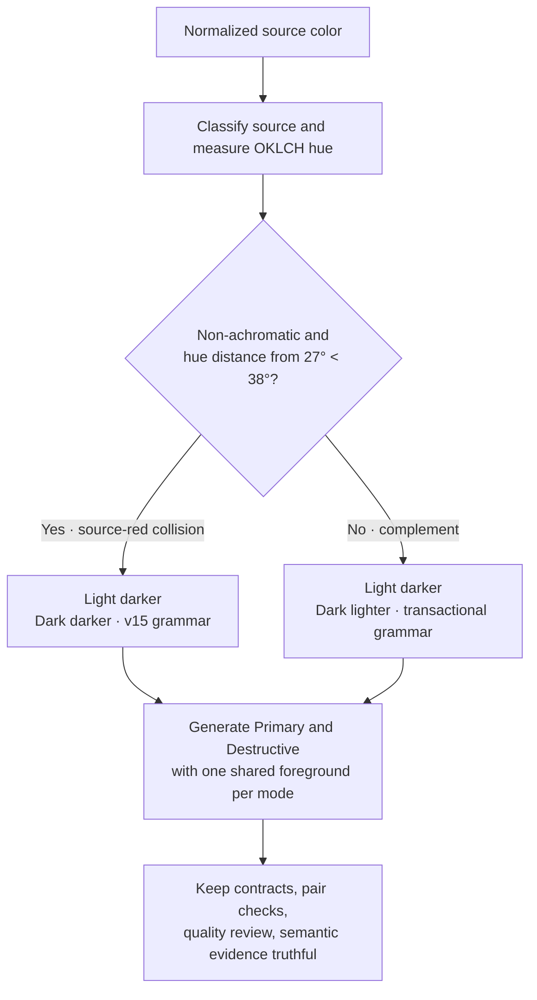

# ADR-0001: Source-red collision-aware filled-action direction

- Status: **Superseded before adoption** by [ADR-0002](0002-red-band-role-collision-presentation.md)
- Date: 2026-08-20
- Production authority: **none**; current production remains `v2-policy-model-15`
- Diagnostic identity: `source-red-collision-aware-mode-relative-actions`

The fixed-corpus evidence remains valid. What is superseded is the proposed
policy response: a source-hue-specific interaction direction is no longer the
leading model.

## Context

Primary와 Destructive는 같은 mode 안에서 하나의 foreground polarity와 state
direction을 공유해야 한다는 interaction intent가 있다. 현재 v15는 Light와 Dark 모두
Default → Hover → Active가 어두워진다. 이 규칙은 완전한 family를 안정적으로 만들지만,
Dark의 resting/default fill이 지나치게 밝아지는 방향으로 search headroom을 요구한다는
디자인 관찰이 있었다.

진단용 mode-relative arm은 Light에서는 어두워지고 Dark에서는 밝아지도록 만들었다.
단순히 방향만 뒤집은 arm은 `0/216`이었지만, Dark Destructive default까지 함께 고르는
transactional arm은 `201/216`을 생성했다. 남은 15개는 red/red-adjacent source에서
`dark.destructive` 후보를 만들지 못했다.

이 15개만 실패 후 fallback하는 정책은 채택하지 않는다. 대신 production에 이미 있는
source-red collision predicate를 **생성 전에** 적용하는 명시적 두 갈래 후보를 검토한다.

## Proposed decision

이것은 “mode별 보편 규칙에 작은 예외”가 아니라, raw source hue가 interaction grammar를
선택하는 **명시적 두 갈래 product policy**다.

| Predicate branch | Light | Dark | Dark Destructive default |
| --- | --- | --- | --- |
| source-red collision | darker | darker | current v15 search |
| predicate complement | darker | lighter | complete lighter-state family를 함께 만족하는 transactional search |

Predicate의 실행 의미는 다음과 같다.

- owner: `destructive-anchor.source-band-applicable`
- source: gamut mapping 전 normalized input에서 측정한 OKLCH hue/classification
- center: `27°`
- radius: `38°`
- comparison: strict `<`
- hue distance: 0°/360° wraparound을 고려한 circular distance
- achromatic: 제외

`27°`와 `38°`는 perceptually validated red definition이 아니다. 현재
Primary/Destructive semantic-role collision을 다루기 위한 provisional product predicate다.

## Fixed-corpus evidence

전용 diagnostic은 failure catch 후 fallback하지 않고 branch를 먼저 선택했다.

- support: `216/216` generated
- source-red collision branch: `41/216`
- mode-relative complement: `175/216`
- direction: Light darker `216`, Dark lighter `175`, Dark darker `41`
- generated-contract introductions: `0`
- pair-eligibility regressions: `0`
- semantic-model regressions: `0`
- Primary/Destructive foreground mismatches: `0`
- case digest: `d6b28ee126b677a48a256f4a55f917fc3af160d049d1a498a4bd6301ef2b8efa`
- selected full-output digest: `41c13b015a9a3c3901b6cbe38d9d810ccd8837797ba5d935be1d3d3e5bd39389`
- 41-input branch digest: `527f704dd7dd0ed3ba7447bcc72655343dfb1f5d397ceb41fa704f8488b856e3`

41개 red-band input 전체가 mode-relative arm에서 실패한 것은 아니다. 15개만 생성
불가능했고, 나머지 26개는 생성 가능했지만 이 proposal에서는 semantic-role collision
cohort의 interaction consistency를 위해 v15 branch에 남긴다.

### Open review ledger

아래 9개 non-red input은 완전한 결과를 생성하지만 새로운
`review.dark.source-fidelity` failure를 가진다.

`#00CCFF`, `#33CCCC`, `#33CCFF`, `#66CC99`, `#66CCCC`, `#99CC00`,
`#99CC33`, `#99CC66`, `#99CC99`

이 false verdict는 유지한다. 사람의 시각 검토가 trade-off를 받아들이더라도 threshold를
재보정하거나 warning을 pass로 바꾸는 것이 아니다. Generator의 “Human review queue”에서
current v15과 mode-relative 결과를 직접 비교해야 한다.

## Why role collision gets a separate branch

Primary source가 semantic red에 가까우면 Primary와 Destructive가 색만으로 구분되기
어렵다. 다른 공개 design system도 이 문제를 interaction direction 하나로 해결한다고
선언하지 않는다. 대체로 danger를 brand와 분리된 semantic token/role로 두고, emphasis,
label, placement, icon, confirmation 같은 비색상 신호를 함께 사용한다.

- [Adobe Spectrum color guidance](https://spectrum.adobe.com/page/using-color/)
- [Carbon color overview](https://carbondesignsystem.com/elements/color/overview/)
- [Atlassian design tokens](https://atlassian.design/foundations/tokens/design-tokens/)
- [Apple HIG: Buttons](https://developer.apple.com/design/human-interface-guidelines/buttons)

이 참고는 branch의 존재 가능성을 뒷받침할 뿐, `27°±38°`를 외부 표준으로 만들지 않는다.

## Acceptance gate

이 ADR은 다음 조건 전에는 **Accepted**로 바뀌지 않는다.

1. 9개 warning input의 Light/Dark resting default와 state progression을 사람이 비교한다.
2. reviewer, date, 비교 대상과 각 warning의 disposition을 이 ADR에 기록한다.
3. `<38°` 경계 안/같음/밖, wraparound, achromatic case를 executable test로 고정한다.
4. production resolver가 `{direction, branchId, predicateId}`를 한 곳에서 반환하고,
   Primary·Destructive generation, quality review, semantic evidence가 같은 값을 소비한다.
5. policy version을 올리고, ontology·rules·spec·interaction docs·trace·snapshots을 같은
   변경 단위에서 갱신한다.

## Consequences and nonclaims

- 장점: fixed corpus 전체에서 완전한 family를 만들면서 non-red Dark default의 lighter-state
  headroom을 확보한다.
- 비용: source hue 경계에서 interaction grammar가 불연속적으로 달라진다.
- 비용: 9개 source-fidelity review failure를 보이는 trade-off가 남는다.
- 이 corpus는 deterministic coverage이지 미적 품질이나 population preference 증거가 아니다.
- 이 proposal은 WCAG/APCA guidance나 보편적인 dark-mode 규칙이 아니다.
- 성공적인 branch generation은 경계 근처 hue가 시각적으로 다르게 행동해야 함을 증명하지 않는다.
