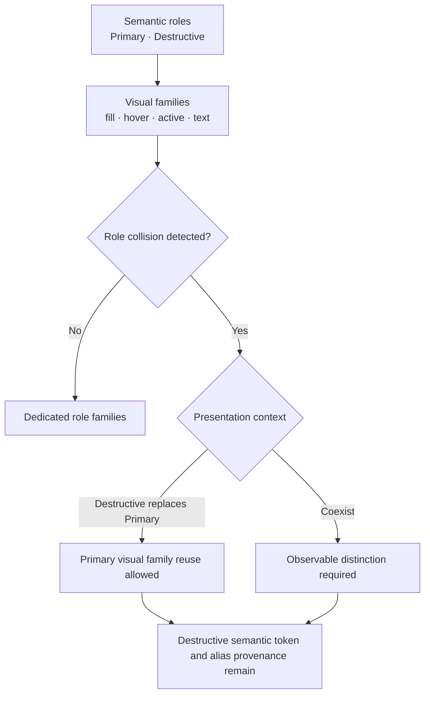

# ADR-0002: Red-band role collision presentation

- Status: **Superseded after operator review**
- Date: 2026-08-20
- Decision authority: **user-delegated implementation decision; operator post-check may revoke it**
- Palette authority: semantic palette generation remains `v2-policy-model-15`
- Presentation authority: `contextual-destructive-emphasis-v1`
- Diagnostic identity: `red-band-role-collision-presentation`
- Superseded by: [ADR-0003](0003-single-filled-action-hierarchy.md)

> 사후 비교에서 stable Destructive family와 일반적인 action hierarchy가 선택되었다.
> 아래 내용은 Primary visual-family reuse를 검토했던 이력으로 보존하며 현재 실행
> authority가 아니다.

## Problem

Primary source가 semantic red에 가까우면 독립적으로 생성한 Primary와 Destructive가
미묘하게 다른 빨강으로 나란히 나타날 수 있다. 이 차이는 의미 구분보다 색 조정
오차처럼 보일 수 있다. 반대로 두 역할을 전역적으로 exact alias하면 현재
`destructive.brand-separation`과 “동시에 보이는 ordinary/destructive action을
구분한다”는 의미 계약을 삭제하게 된다.

핵심 질문은 색 두 개의 거리만이 아니다.

> Ordinary Primary와 Destructive가 동시에 보이는가, 아니면 Destructive가
> 그 문맥의 유일한 high-emphasis action으로 Primary 자리를 대체하는가?

## Accepted ontology

새 개념의 책임은 다음과 같다.

| Concept               | Meaning                                                                     |
| --------------------- | --------------------------------------------------------------------------- |
| Semantic role         | 행동 의미. Primary와 Destructive identity는 항상 분리한다.                  |
| Visual family         | Default·Hover·Active·Text의 실제 rendered value 묶음.                       |
| Role collision        | 서로 다른 semantic role의 visual family가 구분 의도를 만족하기 어려운 상태. |
| Presentation context  | 두 action이 함께 보이는지, 하나가 다른 강조 위치를 대체하는지.              |
| Presentation strategy | dedicated family, replacement reuse, 또는 낮은 emphasis 같은 표현 선택.     |

Ontology에는 `red-band exception`을 최상위 개념으로 넣지 않는다. 현재
`destructive-anchor.source-band-applicable` predicate는 이 일반적인 collision 구조를
검사하는 첫 bounded trigger일 뿐이다. `27°±38°`는 perceptually validated red
definition이 아니다.

## Decision

기본 semantic palette에서는 Primary와 Destructive family를 계속 독립적으로 생성한다.
컴포넌트가 ordinary Primary의 존재 여부를 명시한 뒤 다음 presentation strategy를
적용한다.

| Collision trigger | Ordinary Primary in the action region | Applied strategy              |
| ----------------- | ------------------------------------- | ----------------------------- |
| false             | either                                | `dedicated-role-families`     |
| true              | true                                  | `dedicated-role-families`     |
| true              | false                                 | `reuse-primary-visual-family` |

현재 첫 collision trigger는 기존
`destructive-anchor.source-band-applicable`이다. 이 predicate는 raw source가
achromatic이 아니고 hue 27°에서 circular distance가 38° 미만일 때만 true다.
이는 임시 product predicate이지 검증된 red 지각 경계가 아니다.

이 선택은 사람이 비교 화면을 먼저 조작해야만 진행되는 방식을 대체한다. 구현자가
역할 구분, 공식 design-system precedent, palette/component ownership을 기준으로 bounded
default를 선택했으며, 사용자는 실제 applied specimen을 사후 검토해 결정을 철회할 수
있다. 자동 검사는 미적 우수성을 주장하지 않는다.

## Fixed decisions

1. Primary와 Destructive token identity는 분리한다.
2. Production palette generation, policy v15, export, cache는 변경하지 않는다.
3. `danger-replaces-primary`에서는 ordinary Primary가 같은 action group에 존재하지 않는다.
4. reuse된 family의 state/foreground evidence는 Primary producer evidence를 상속하지만,
   Primary↔Destructive separation을 pass로 위조하지 않는다. 상태는
   `not-applicable-ordinary-primary-absent`다.
5. 두 역할을 동시에 exact value로 보여 주는 화면은 adoption candidate가 아니라
   ambiguity control이다.

## Applied specimen and comparison

Generator의 red-band role-collision section은 실제 `#FF0000` production result에서
Light와 Dark 각각 세 문맥을 보여 준다.

1. **Dedicated families** — current independent Primary/Destructive values.
2. **Destructive replaces Primary** — ordinary Primary 없이 `Delete project`가 Primary
   visual family를 재사용한다.
3. **Simultaneous identical control** — 두 역할을 같은 family로 함께 보여 현재
   role-separation intent와의 충돌을 직접 관찰한다.

각 버튼은 실제 Default·Hover·Active token으로 동작한다. 메인 applied specimen의
`Move to Trash` footer는 ordinary Primary가 없는 별도 action region이므로 red-band에서
accepted replacement strategy를 실제 적용한다. 비교 section은 채택안과 기각한
simultaneous-identical control을 계속 나란히 보여 사후 검토가 가능하게 한다.

같은 section은 palette token을 다시 생성하지 않고 component hierarchy만 바꾸는 세
가지 실제 표본도 Light/Dark 각각 제공한다.

1. **Problem · two filled reds** — Primary와 Destructive가 모두 filled여서 같은 강조도로
   경쟁하는 충돌 표본이다.
2. **Routine coexistence** — ordinary Primary는 filled로 유지하고 Delete는 안정적인
   Destructive family의 default red를 text/border로 쓰는 outline action으로 낮춘다.
3. **Destructive confirmation** — ordinary Primary를 제거하고 Cancel보다 높은 강조도의
   filled Destructive만 둔다.

두 해결 표본은 `destructive` semantic token을 Primary로 alias하지 않는다. Outline과
filled는 component presentation variant이며, 어느 표본이 더 아름답거나 안전한지는
자동 검사가 판정하지 않는다.

## External precedent boundary

- [Atlassian color roles](https://atlassian.design/foundations/color)은 brand와 danger를
  별도 semantic role/token으로 둔다.
- [Carbon Button](https://carbondesignsystem.com/components/button/usage/)은 Primary와
  Danger를 별도 variant로 유지한다.
- [Carbon Danger modal](https://carbondesignsystem.com/components/modal/usage/)에서는
  ordinary Primary button을 Danger button으로 대체한다.
- [Apple Buttons](https://developer.apple.com/design/human-interface-guidelines/buttons)은
  Primary와 Destructive 역할을 분리하고 destructive action에 Primary role을 주지
  않도록 안내한다.

이 사례들은 contextual replacement를 지지하지만 global token equality나 이 프로젝트의
red-band predicate를 검증하지 않는다.

## Post-check questions

- replacement 문맥이 미묘하게 다른 두 빨강보다 자연스럽게 읽히는가?
- simultaneous identical control은 실제로 역할 모호성을 만드는가?
- replacement strategy를 쓰면 red-band에서도 universal Light-darker/Dark-lighter
  Primary grammar를 사용할 수 있는가?
- footer 밖의 실제 consumer도 ordinary Primary의 부재를 명시적으로 보장할 수 있는가?

## Acceptance

- red-band 안/경계/밖의 context classification이 executable evidence로 고정된다.
- replacement specimen은 ordinary Primary가 없고 Destructive semantic label/provenance가 남는다.
- simultaneous specimen은 current separation contradiction을 숨기지 않는다.
- applied specimen은 red-band destructive-only context에서 Primary family를 실제 렌더링한다.
- non-red와 coexisting context는 dedicated family를 유지한다.
- operator post-check가 거부하면 이 ADR을 Superseded 또는 Rejected로 바꾸고 resolver를 제거한다.
- generator-level alias 또는 direction policy 변경은 별도 ADR과 full-corpus 검증을 거친다.

## Nonclaims

- Exact equality가 접근성 실패임을 입증하지 않는다.
- Label, placement, icon만으로 destructive meaning이 충분하다고 입증하지 않는다.
- 다른 design system의 replacement pattern이 이 palette의 token equality를 승인하지 않는다.
- 이 UI 비교는 production adoption, 미적 최적값 또는 population preference가 아니다.
