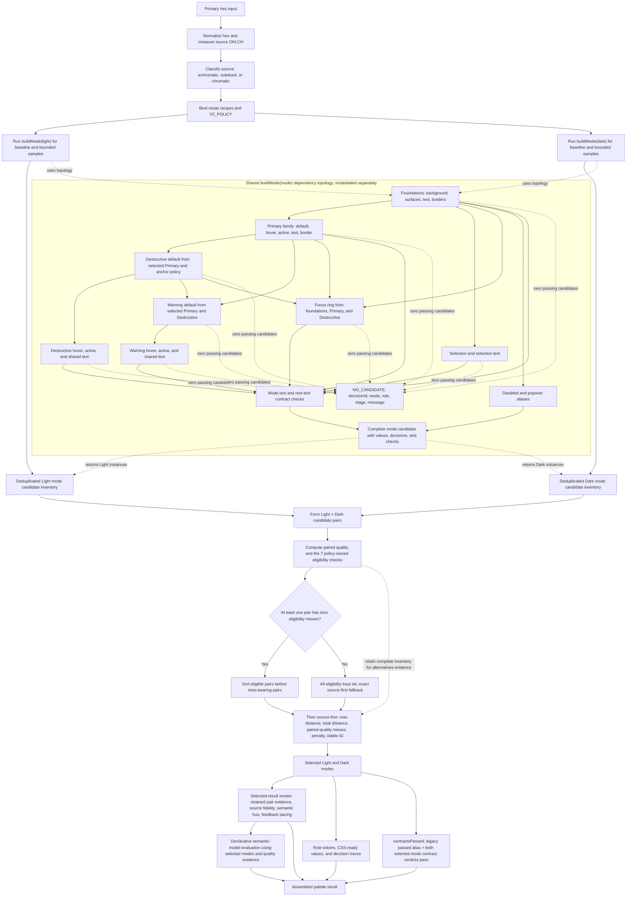
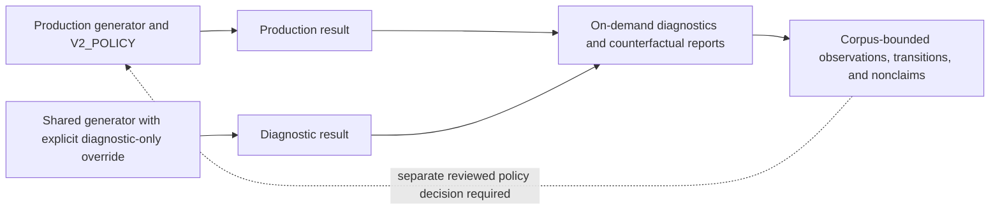

# Color decision flow

이 문서는 현재 프로덕션 v2 색상 결정 흐름을 Mermaid로 관리하는 정본 동반
문서다. 실행 가능한 권위는 `v2/lib/` 코드와 `V2_POLICY`에 있으며, 이 문서는
그 코드의 단계, 의존성, 선택 권위를 사람이 검토할 수 있게 압축한다.

현재 기준은 `v2-policy-model-12`와
`zero-primary-pair-quality-miss-gated-source-first` pair 전략이다.

## Production flow

`buildMode(mode)` topology는 동일한 구조로 Light와 Dark에서 각각 독립 실행된다.
각 mode의 baseline과 bounded start/mid/end sample은 rendered Primary 기준으로
deduplicate된다. 이후 pair 단계가 완성된 mode bundle들을 함께 비교하므로, 한
역할의 변경은 상태색과 Warning뿐 아니라 최종 Light/Dark 조합에도 전파될 수 있다.

pair eligibility의 7개 check ID는 `policy.js`가 소유한다.

- `pair.primary-hue-drift`
- `pair.primary-chroma-difference`
- `pair.primary-lightness-gap`
- `light.primary.state.interval-ratio`
- `light.primary.state.monotonic-lightness`
- `dark.primary.state.interval-ratio`
- `dark.primary.state.monotonic-lightness`

하나라도 zero-miss pair가 있으면 eligibility key가 해당 pair들을 miss-bearing
pair보다 앞에 둔다. 후보를 삭제하지 않으므로 complete inventory는 alternatives
evidence에 남는다. zero-miss pair가 없으면 모든 eligibility key가 같아져 전체
후보에 기존 source-first 순서가 그대로 적용된다. 이 gate의 선택 권위와 각 수치
threshold의 경험적 권위는 같은 개념이 아니다. 현재 threshold는 여전히
provisional이다.

`result.verdicts`는 contract, quality review, semantic model의 권위를 분리한다.
`result.contractsPassed`는 선택된 Light/Dark mode의 text·non-text contract
verdict만으로 계산하고, 기존 `result.passed`는 같은 값의 호환 alias로 유지한다.
selected-result quality review와 semantic evaluation은 별도 verdict로 보존되며
contract pass boolean의 권위가 아니다.

## Diagnostic boundary

진단 report는 production 결과를 검증·비교하지만 production cache, UI, 정책 또는
선택 권위를 직접 변경하지 않는다. 진단에서 사용한 ladder, fallback, ranking
override를 production 노드로 그려서는 안 된다.

## Ownership map

| Flow area                                                                              | Executable owner                                                     |
| -------------------------------------------------------------------------------------- | -------------------------------------------------------------------- |
| Input normalization and color measurements                                             | `v2/lib/palette.js`, `v2/lib/runtime.js`, shared `lib/color-math.js` |
| Policy IDs, thresholds, ranges, and pair strategy                                      | `v2/lib/policy.js`                                                   |
| Light/Dark recipes                                                                     | `v2/lib/roles.js`                                                    |
| Mode orchestration, foundations, Primary, states, Focus, Selection, aliases, contracts | `v2/lib/palette.js`                                                  |
| Destructive and Warning base-fill searches                                             | `v2/lib/feedback-search.js`                                          |
| Light/Dark sampling, pair evidence, eligibility gate, and ranking                      | `v2/lib/pair-selection.js`                                           |
| Paired and selected-result quality evidence                                            | `v2/lib/quality.js`                                                  |
| Declarative semantic evaluation                                                        | `v2/lib/semantic-model.js`                                           |
| Mode-scoped CSS serialization                                                          | `v2/lib/palette.js`                                                  |
| Reference-token export artifact assembly                                               | `v2/lib/reference-export.js`                                         |
| Candidate ranking and structured exhaustion failures                                   | `v2/lib/decision.js`                                                  |

## Maintenance contract

다음 변경은 이 문서를 같은 변경 단위에서 갱신해야 한다.

- 역할 생성 단계, 역할 간 의존성 또는 mode assembly 순서가 바뀐다.
- 후보 inventory, pair eligibility membership, fallback 또는 ranking 권위가 바뀐다.
- review와 selection 사이의 경계가 바뀐다.
- production과 diagnostic의 경계 또는 output contract가 바뀐다.
- `V2_POLICY.version`이나 production pair strategy ID가 바뀐다.

갱신 시에는 다음을 확인한다.

1. Mermaid 노드와 edge가 실제 호출 순서 및 데이터 의존성을 나타낸다.
2. 문서의 policy version과 pair strategy가 `policy.js`와 일치한다.
3. diagnostic-only 동작이 production flow에 포함되지 않는다.
4. `npm run check`와 `npm run build`가 통과한다.
