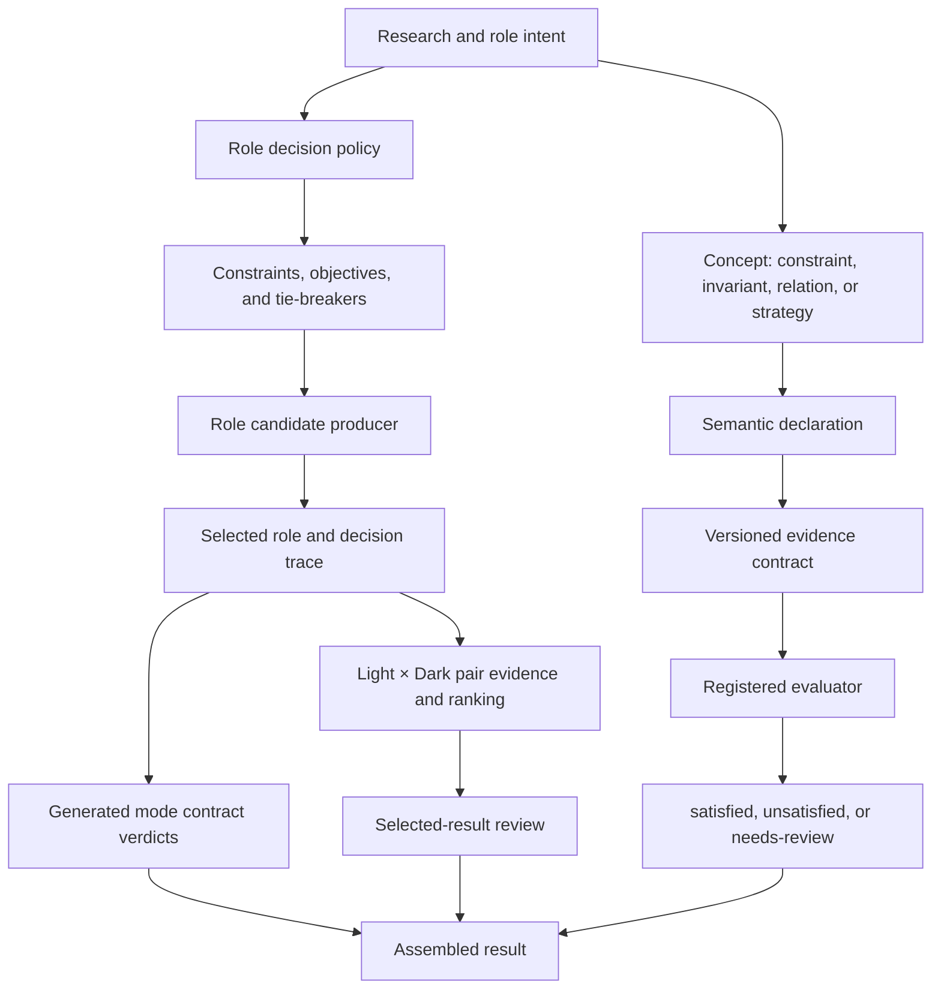

# Color decision ontology and executable rules

이 문서는 Color Lab v2가 어떤 개념에서 출발해 어떤 실행 규칙을 지키는지 연결하는
상위 지도다. 실행 가능한 정본은 `v2/lib/`와 `V2_POLICY`이며, 이 문서는 stable ID와
소유 경계를 사람이 검토할 수 있게 연결한다. 수치 공식이나 candidate loop를 복사해
두 번째 정책 엔진을 만들지 않는다.

현재 production identity는 다음과 같다.

- result schema: `2`;
- policy: `v2-policy-model-12`;
- semantic model: `v2-declarative-design@3`;
- pair strategy: `zero-primary-pair-quality-miss-gated-source-first`.

## Ontology layers

이 계층은 서로 대체되지 않는다.

- semantic declaration은 디자인 의도를 이름 붙이지만 candidate를 선택하지 않는다.
- decision policy는 candidate를 선택하지만 그 자체로 지각적 타당성을 증명하지 않는다.
- generated contract는 선언된 text/non-text 계약만 판정한다.
- selected-result review는 선택에 사용된 pair evidence와 선택 후 review signal을 함께
  보존한다.
- diagnostic report는 fixed corpus 관찰이며 production 정책 권위가 아니다.

## Core concepts

| Concept | Meaning | Executable owner | Allowed outcome |
| --- | --- | --- | --- |
| `constraint` | candidate 또는 semantic evidence가 반드시 만족해야 하는 선언 | `policy.js`, `semantic-model.js` | pass/fail 또는 semantic status |
| `invariant` | 출력 구조에서 항상 유지돼야 하는 성질 | `semantic-model.js` | semantic status |
| `relation` | 역할이나 상태 사이에 의도한 순서·분리를 선언 | `semantic-model.js` | semantic status |
| `strategy` | candidate를 제안하거나 순위를 정하는 교체 가능한 메커니즘 | role producer, `decision.js`, `pair-selection.js` | selected decision trace |
| evidence contract | evaluator가 요구하는 producer, 관찰 범위와 nonclaim | `semantic-model.js` | complete/incomplete evidence |
| generated contract | 선택된 mode의 text/non-text 사용성 계약 | `palette.js` | `passed` boolean |
| selected-result review | retained pair evidence와 post-selection signal의 묶음 | `quality.js` | review `passed` boolean |
| diagnostic | production 밖에서 실행하는 비교·관찰 | diagnostic modules | corpus-bounded finding |

## Semantic declarations

모든 declaration은 `declaration → evidence contract → evaluator → acceptance test`로
연결된다. `satisfied`는 이 표에 선언된 자동 관계만 만족했다는 뜻이다.

| Declaration | Kind | Authority | Evidence contract | Evaluator |
| --- | --- | --- | --- | --- |
| `shared-label-readable` | constraint | heuristic | `evidence.primary-label-apca.v1` | `evaluator.primary-label-readable.v1` |
| `states-distinct` | invariant | technical | `evidence.primary-exported-states.v1` | `evaluator.primary-states-distinct.v1` |
| `active-continues-beyond-hover` | relation | research-policy | `evidence.primary-state-progression.v1` | `evaluator.primary-state-progression.v1` |
| `foundation-hierarchy-ordered` | relation | research-policy | `evidence.foundation-hierarchy-decisions.v1` | `evaluator.foundation-hierarchy.v1` |
| `foundation-text-targets-pass` | constraint | heuristic | `evidence.foundation-text-apca.v1` | `evaluator.foundation-text-targets.v1` |
| `focus-adjacent-contrast-passes` | constraint | normative | `evidence.focus-foundation-contrast.v1` | `evaluator.focus-adjacent-contrast.v1` |
| `focus-control-oklab-separation-passes` | relation | heuristic | `evidence.focus-semantic-separation.v1` | `evaluator.focus-control-oklab-separation.v1` |
| `feedback-destructive-label-targets-pass` | constraint | heuristic | `evidence.destructive-label-apca.v1` | `evaluator.feedback-destructive-label-targets.v1` |
| `feedback-warning-label-targets-pass` | constraint | heuristic | `evidence.warning-label-apca.v1` | `evaluator.feedback-warning-label-targets.v1` |
| `feedback-oklab-separation-passes` | relation | heuristic | `evidence.feedback-oklab-separation.v1` | `evaluator.feedback-oklab-separation.v1` |
| `selection-text-target-passes` | constraint | heuristic | `evidence.selection-text-apca.v1` | `evaluator.selection-text-target.v1` |
| `selection-surface-oklab-separation-passes` | relation | heuristic | `evidence.selection-surface-separation.v1` | `evaluator.selection-surface-oklab-separation.v1` |

각 declaration은 positive, contradictory, missing-evidence acceptance scenario를
하나씩 가져야 한다. 빠른 테스트는 unknown evidence/evaluator, 잘못된 authority,
duplicate ID, coverage 누락을 거부한다.

## Role decision rules

`V2_POLICY.decisions`는 candidate lifecycle을 `constraints → objectives → tie-breakers`로
고정한다. constraint를 모두 통과한 candidate만 objective와 stable tie-breaker로
정렬된다.

| Decision | Constraints | Objective | Stable tie-breaker |
| --- | --- | --- | --- |
| `state` | `state.minimum-separation` | `state.minimum-change` | `stable.hex-order` |
| `labeledState` | `state.minimum-separation`, `state.shared-label` | `state.minimum-change` | `stable.hex-order` |
| `primary` | `primary.generated-family`, `primary.mode-range`, `primary.calm-chroma`, `primary.shared-label` | `primary.source-fidelity` | `stable.hex-order` |
| `destructive` | `destructive.label-contrast`, `destructive.brand-separation` | `destructive.semantic-anchor` | `stable.hex-order` |
| `foundationAnchor` | `foundation.mode-zone`, `foundation.calm-tint` | `foundation.recipe-fidelity` | `stable.hex-order` |
| `foundationLayer` | `foundation.hierarchy`, `foundation.calm-tint` | `foundation.recipe-fidelity` | `stable.hex-order` |
| `foundationText` | `foundation.text-contrast`, `foundation.calm-tint` | `foundation.recipe-fidelity` | `stable.hex-order` |
| `foundationInput` | `foundation.boundary-contrast`, `foundation.calm-tint` | `foundation.recipe-fidelity` | `stable.hex-order` |
| `binaryText` | `text.required-contrast` | `text.maximize-weakest-contrast` | `stable.hex-order` |
| `focus` | `focus.adjacent-contrast`, `focus.semantic-separation`, `focus.brand-relation` | `focus.minimum-brand-distance` | `stable.hex-order` |
| `primaryBorder` | `primary-border.adjacent-contrast` | `primary-border.minimum-brand-distance` | `stable.hex-order` |
| `warning` | `feedback.label-contrast`, `feedback.semantic-separation` | `feedback.semantic-anchor` | `stable.hex-order` |
| `selection` | `selection.text-contrast`, `selection.surface-separation` | `selection.minimum-emphasis` | `stable.hex-order` |

후보가 하나도 constraint를 통과하지 못하면 `NO_CANDIDATE`가 발생한다. 이 실패는
`decisionId`, `mode`, `role`, `candidate-selection` stage를 가지며, diagnostic은 이
구조화된 provenance를 검증한 경우에만 예상된 infeasibility로 기록한다.

## Pair-selection authority

Light와 Dark의 완성된 mode bundle을 조합한 뒤 다음 7개 ID가 pair eligibility를
구성한다.

- `pair.primary-hue-drift`
- `pair.primary-chroma-difference`
- `pair.primary-lightness-gap`
- `light.primary.state.interval-ratio`
- `light.primary.state.monotonic-lightness`
- `dark.primary.state.interval-ratio`
- `dark.primary.state.monotonic-lightness`

하나 이상의 zero-miss pair가 있으면 eligible pair가 먼저 정렬된다. 없으면 모든
eligibility key가 같아져 complete inventory에 source-first 순서가 적용된다. 이
7개 ID의 gate membership은 product-policy 선택 권위지만, 각 수치 threshold는
provisional evidence다. Destructive/Warning pacing은 이 gate에 들어가지 않는다.

## Authority ontology

세 종류의 authority를 섞지 않는다.

### Rule and declaration evidence authority

코드가 허용하는 닫힌 vocabulary는 다음뿐이다.

- `normative`
- `product-policy`
- `provisional`
- `technical`
- `heuristic`
- `research-policy`

`evidence-authority.js`, `validatePolicy()`, `validateSemanticTraceability()`가 unknown
값을 fail closed로 거부한다.

### Aggregate verdict scope

| Result field | Authority ID | What it means |
| --- | --- | --- |
| `verdicts.contracts.passed` | `generated-contracts` | 선택된 Light/Dark mode contract가 모두 통과 |
| `verdicts.qualityReview.passed` | `selected-result-review` | retained pair evidence와 모든 review check가 통과 |
| `verdicts.semanticModel.satisfied` | `declarative-semantic-model` | 현재 선언된 semantic model만 모두 satisfied |

기존 `result.passed`는 `contractsPassed`의 호환 alias이며 전체 품질 판정이 아니다.

### Diagnostic authority

`diagnostic`은 on-demand report와 override의 범위를 표시한다. rule evidence
authority나 aggregate verdict가 아니며, 별도의 검토와 policy version 변경 없이
production 선택 권위가 될 수 없다.

## Explicit nonclaims

현재 규칙을 모두 통과해도 다음은 성립하지 않는다.

- 전체 palette의 미적 품질 또는 선호도
- 지각 가능한 hover·focus·semantic meaning의 보편적 보장
- 완전한 WCAG 또는 접근성 인증
- provisional threshold의 경험적 타당성이나 최적성
- fixed 216-color diagnostic corpus에서의 비율을 population prevalence로 일반화
- diagnostic counterfactual의 production 채택

## Executable ownership and tests

| Layer | Owner | Primary acceptance surface |
| --- | --- | --- |
| ontology vocabulary | `semantic-model.js`, `evidence-authority.js` | `test/v2-semantic-model.test.js`, `test/v2-evidence-authority.test.js` |
| decision rules | `policy.js`, role producers | `test/v2-decision.test.js`, `test/v2-palette.test.js` |
| pair eligibility and ranking | `pair-selection.js`, `policy.js` | `test/v2-pair-ranking-counterfactual.test.js` |
| generated contracts | `palette.js` | `test/v2-palette.test.js`, exhaustive grid |
| selected-result review | `quality.js` | palette and adversarial diagnostic tests |
| diagnostic boundary | dedicated diagnostic modules | focused fast tests and on-demand heavy snapshots |
| human-readable flow | `color-decision-flow.md` | `test/v2-color-decision-flow-doc.test.js` |

## Maintenance contract

다음 변경은 이 문서와 연결된 표를 같은 변경 단위에서 갱신해야 한다.

1. semantic concept, declaration, evidence contract 또는 evaluator ID가 바뀐다.
2. decision ID나 constraint/objective/tie-breaker membership이 바뀐다.
3. pair eligibility ID, fallback 또는 ranking authority가 바뀐다.
4. evidence authority vocabulary나 aggregate verdict scope가 바뀐다.
5. selection, selected-result review, semantic evaluation, diagnostic 경계가 바뀐다.

새 규칙은 최소한 stable ID, owner, authority, executable acceptance, nonclaim을 가져야
한다. 이 중 하나가 없으면 구현 상수는 존재할 수 있어도 정당화된 정책으로 취급하지
않는다.
