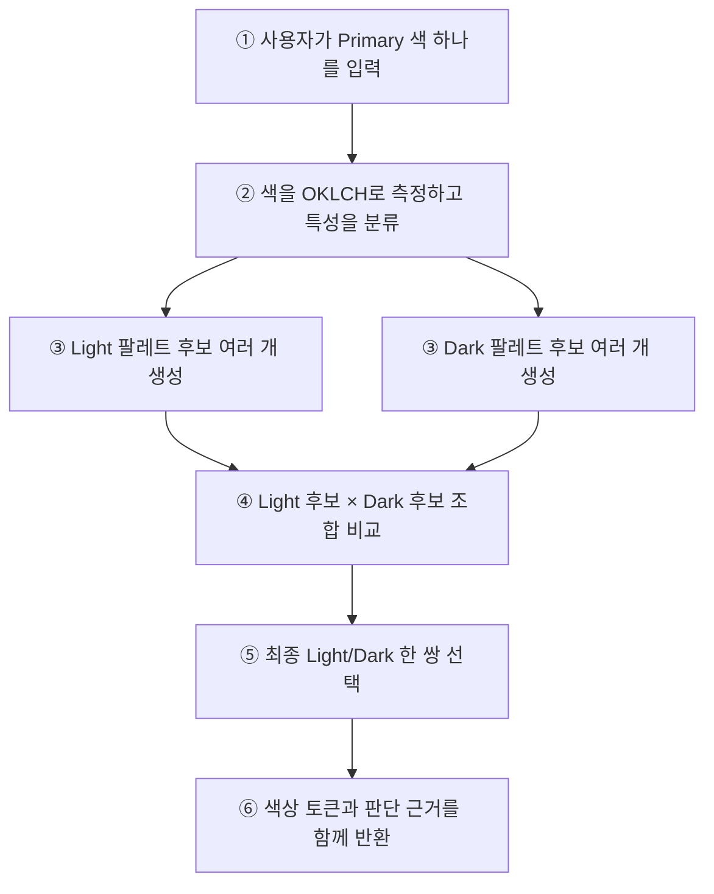
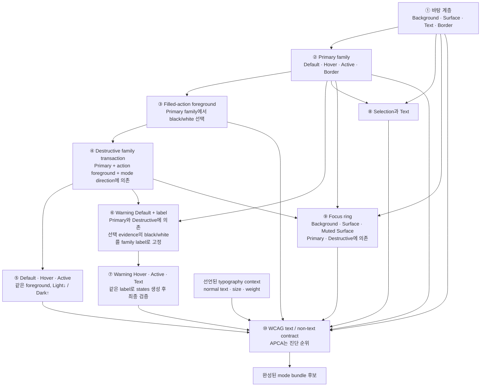
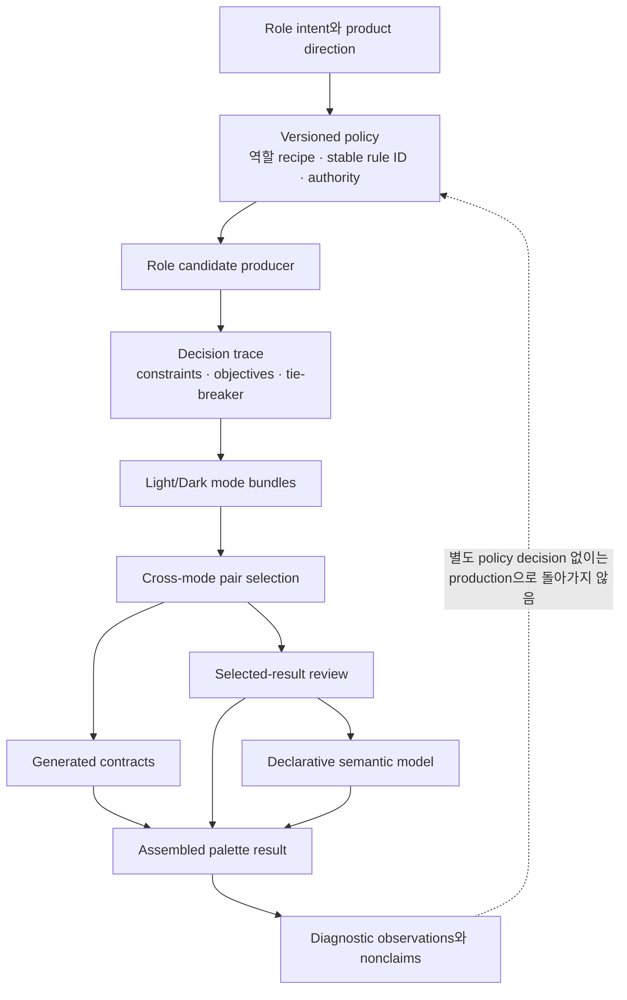
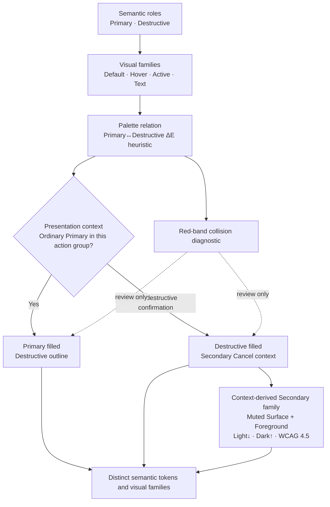

# Color system ontology

이 문서는 Color Lab v2를 이루는 개념과 역할 의존성을 설명하는 상위 지도다.
규칙이 후보를 탈락시키고 순위를 바꾸며 결과를 검토하는 자세한 과정은
[Color decision rules](rules.md)가 다이어그램과 역할별 카드로 설명한다.

실행 가능한 정본은 `v2/lib/`와 `V2_POLICY`다. 이 문서는 수치 공식이나 candidate
loop를 복사하지 않고 사람이 검토할 수 있는 개념과 소유 경계를 관리한다.

현재 production identity는 다음과 같다.

- result schema: `3`;
- policy: `v2-policy-model-20`;
- semantic model: `v2-declarative-design@5`;
- pair strategy: `zero-primary-pair-quality-miss-gated-source-first`.

## 먼저 보는 전체 그림

이 프로젝트는 입력 색 하나를 바로 여러 UI 색으로 변환하지 않는다. Light와 Dark
각각에서 여러 팔레트 후보를 만든 뒤, 두 모드를 한 쌍으로 비교해 최종 결과를 고른다.

핵심은 두 가지다.

- 각 역할의 색은 하나의 공식으로 바로 계산하지 않고 여러 후보 중에서 선택한다.
- Light와 Dark는 따로 완성한 뒤 두 모드의 관계까지 비교한다.

## 프로젝트를 이루는 개념

| 쉬운 이름        | 코드·문서 용어         | 뜻                                                                                                 |
| ---------------- | ---------------------- | -------------------------------------------------------------------------------------------------- |
| 입력 색          | Primary source         | 사용자가 입력한 hex와 측정된 OKLCH 값                                                              |
| 색의 특성        | classification         | 채도에 따라 `achromatic`, `subdued`, `chromatic`으로 구분한 결과                                   |
| 화면 모드        | mode                   | 독립적으로 생성되는 Light 또는 Dark 환경                                                           |
| 색의 임무        | role                   | Background, Primary, Destructive, Warning, Focus처럼 UI에서 맡은 역할                              |
| 역할 묶음        | family                 | default·hover·active·text처럼 함께 동작해야 하는 한 역할의 색들                                    |
| 색 후보          | candidate              | 해당 역할이 될 가능성이 있어 검사와 순위 비교를 받는 색                                            |
| 선택 기록        | decision               | 왜 이 후보를 선택했고 다른 후보는 탈락했는지 남긴 근거                                             |
| 모드 팔레트 후보 | mode bundle            | 한 모드의 모든 역할색과 검사 결과를 담은 완성 후보                                                 |
| 모드 조합        | pair                   | Light mode bundle 하나와 Dark mode bundle 하나의 조합                                              |
| 측정 근거        | evidence               | contrast, 색 거리, 상태 변화량처럼 판단에 사용된 사실                                              |
| 범위별 판정      | verdict                | 생성 계약, 선택 결과 검토, semantic model 각각의 결과                                              |
| 별도 실험        | diagnostic             | production을 바꾸지 않고 고정 입력 집합에서 비교한 관찰                                            |
| 사용 문맥        | presentation context   | 같은 semantic role을 filled·outline·absent 중 어떻게 표시할지 정하는 component 입력                |
| 문맥 파생 상태군 | context-derived family | 실제 component 배경과 text 역할을 소비해 만들며 context-free palette에는 export하지 않는 상태 묶음 |
| 의무 적용 범위   | obligation scope       | 규칙이 role 자체, 완전한 family, role 사이 관계, 실제 presentation 중 어디에 적용되는지            |
| 글자 사용 맥락   | typography context     | text가 normal/large 중 무엇이며 specimen에서 어떤 크기·굵기로 쓰이는지 명시한 계약                 |

Role은 단순한 색 이름이 아니라 사용 의무다. 예를 들어 Destructive는 단순히
“빨간색”이 아니라 읽을 수 있는 label, 완성된 hover/active family, Primary와의
거리 review를 함께 가지는 feedback 역할이다. 거리 review가 false여도 role identity가
사라지거나 생성 contract가 자동으로 실패하지는 않는다.

세 input classification의 정확한 chroma 경계와 실제 생성 분기는
[입력 Primary를 측정하는 과정](rules.md#1-입력-primary를-측정한다)에서 설명한다.

## 한 mode가 만들어지는 순서

다음 흐름은 Light와 Dark에서 각각 반복된다. 화살표는 먼저 선택된 역할이 다음
역할의 입력으로 사용된다는 뜻이다.

Primary lightness를 bounded sample로 생성하기 때문에 mode bundle 후보가 여러 개
나온다. 같은 rendered Primary를 가진 중복 후보는 제거한다. 그 뒤의 후보 선택,
Light×Dark pair ranking과 결과 검증은 [규칙 문서](rules.md)가 설명한다.

## 개념 계층과 권위 경계

이 계층은 서로 대체되지 않는다.

- policy는 candidate 선택 권위를 정의하지만 지각적 타당성을 증명하지 않는다.
- generated contract는 선택된 mode의 text/non-text 계약만 판정한다.
- selected-result review는 retained pair evidence와 선택 후 signal을 보존한다.
- semantic model은 선언된 관계만 평가하며 candidate를 다시 선택하지 않는다.
- diagnostic은 fixed corpus 관찰이며 production policy가 아니다.

Light Warning의 appearance는 이 경계를 실제로 통과한 사례다. v18 diagnostic은
후보 부족이 아니라 anchor 선택이 탁한 결과를 만든다는 사실을 분리했고, 사람의
Default-first disposition 후 [ADR-0007](adr/0007-light-warning-vivid-amber.md)이
Light recipe만 production v19로 승격했다. Dark는 별도 mode sibling이므로 같은 숫자를
자동 상속하지 않는다.

현재 policy v20은 그 recipe를 바꾸지 않고 Warning label의 소유 경계를 고쳤다.
Default 선택 evidence가 기록한 label을 family producer가 한 번 채택하고,
Hover·Active·최종 Text가 같은 값을 사용한다. 최종 Text는 다시 고르는 역할이 아니라
완성된 세 fill에 대한 `fixedTextValidation`이다. 이 변경은
[ADR-0008](adr/0008-warning-shared-label-transaction.md)이 소유한다.

## Action group hierarchy와 role collision

현재 ontology는 semantic role과 실제 visual family 뒤에 `action group hierarchy`를
둔다. Palette 생성은 Primary / Destructive family를 모든 입력에서 서로 구분해
유지한다. Component presentation은 두 색을 다시 만들거나 alias하지 않고, 같은 action
group 안에서 어느 역할이 filled emphasis를 갖는지만 정한다.

여기서 **semantic role identity**와 **동시에 표시된 fill 사이의 시각적 분리**는 같은
개념이 아니다. Role identity는 token 이름과 사용 의무로 항상 유지된다. 반면 실제
동시 구분은 presentation context에 따라 달라진다. Production v16은
`destructive.brand-separation`을 전역 생성 constraint가 아니라 context-free palette의
**selected-result review**로 보존한다. Accepted hierarchy의 presentation 의무, 별도로
존재하는 semantic role identity, 실제 거리가 `0.08`을 넘는지 알리는 review
evidence를 분리한 것이다. 이 authority 이동은
[ADR-0004](adr/0004-mode-relative-filled-actions-and-contextual-separation.md)가 소유한다.

[Contextual separation 진단](research/contextual-destructive-separation.md)은 이 구분을
실제로 실행했다. `0.08`을 생성 eligibility에서만 제외하자 fixed 216 입력이 모두
완전 생성되고 contract·pair eligibility의 새 실패는 없었다. 동시에 22개 입력의
separation relation은 계속 `unsatisfied`로 남고 Dark source-fidelity finding 9건이
새로 생겼다. 따라서 role identity와 relationship evidence를 분리할 수 있다는 강한
구조적 근거와 operator의 bounded visual disposition을 결합해 v16에서 authority를 이동했다.

현재 source-red predicate는 두 역할이 특히 비슷할 수 있음을 알리는 bounded diagnostic
trigger다. Red 자체를 ontology의 예외 type으로 만들지 않으며 presentation strategy를
선택할 authority도 없다. Executable component-presentation authority는
`single-filled-action-hierarchy-v2`다. Confirmation Secondary의 상태는 exported palette
role이 아니라 Muted Surface와 Foreground를 소비하는 context-derived family다. 위계는
낮게 유지하되 같은 mode 방향을 따르고 실제 state label contrast를 검사한다. 이 경계와
Focus의 Muted Surface 의무는
[ADR-0006](adr/0006-context-derived-secondary-action-states.md)이 소유한다. 이전 Primary-family reuse
결정은 [ADR-0002](adr/0002-red-band-role-collision-presentation.md)에 superseded history로,
이전 방향 분기 후보와 216-input 증거는
[ADR-0001](adr/0001-source-red-collision-aware-filled-action-direction.md)에 superseded
evidence로 남는다.

## 문서와 코드 연결

| 알고 싶은 것                      | 사람이 읽는 문서                                       | 실행 소유자                  |
| --------------------------------- | ------------------------------------------------------ | ---------------------------- |
| 프로젝트 개념과 역할 의존성       | 이 문서                                                | `palette.js`, role producers |
| 규칙의 실제 실행 순서와 stable ID | [Color decision rules](rules.md)                       | `policy.js`, `decision.js`   |
| 역할별 규칙이 필요한 이유         | [Role policies](policy/roles.md)                       | `policy.js`, role producers  |
| authority와 provenance            | [Evidence authority](policy/evidence.md)               | `evidence-authority.js`      |
| semantic declaration              | [Semantic model](policy/semantic-model.md)             | `semantic-model.js`          |
| 후보와 trace 실행 구조            | [Candidate search](implementation/candidate-search.md) | `decision.js`                |
| bounded diagnostic 결과           | [Research](README.md#research)                         | dedicated diagnostic modules |

## Executable ownership and tests

| Layer                             | Owner                                              | Primary acceptance surface                     |
| --------------------------------- | -------------------------------------------------- | ---------------------------------------------- |
| ontology vocabulary               | `semantic-model.js`, `evidence-authority.js`       | semantic/evidence authority tests              |
| role dependency and mode assembly | `palette.js`, role producers                       | `test/v2-palette.test.js`                      |
| decision rules                    | `policy.js`, `decision.js`                         | `test/v2-decision.test.js`                     |
| pair eligibility and ranking      | `pair-selection.js`, `policy.js`                   | pair ranking tests                             |
| generated contracts               | `palette.js`                                       | palette tests and exhaustive grid              |
| selected-result review            | `quality.js`                                       | palette and adversarial tests                  |
| diagnostic boundary               | dedicated diagnostic modules                       | focused tests and heavy snapshots              |
| text contrast policy diagnostic   | `text-contrast-strategy.js`, counterfactual report | `test/v2-text-contrast-counterfactual.test.js` |
| human-readable ontology and rules | `ontology.md`, `rules.md`                          | `test/v2-color-system-doc.test.js`             |

## Maintenance contract

다음 변경은 이 문서와 연결된 다이어그램을 같은 변경 단위에서 갱신해야 한다.

1. semantic concept나 역할 의존성이 바뀐다.
2. 역할 생성 단계 또는 mode assembly 순서가 바뀐다.
3. candidate, family, pair, evidence, verdict, diagnostic의 의미가 바뀐다.

세부 규칙, pair authority, semantic declaration 또는 verdict scope가 바뀌면
[Color decision rules](rules.md)를 갱신한다.
