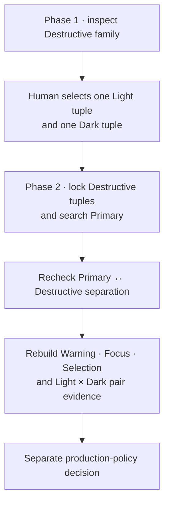

# Destructive-first filled-action grammar calibration

## Problem

The resting/default button is visible much longer than hover or pressed. The
interaction grammar should therefore be chosen around a visually acceptable
Destructive default in each mode, rather than choosing a Primary first and
letting its foreground determine every later action state.

## Declared design principle

“Destructive is relatively fixed” means that its semantic red hue/chroma recipe
and bounded mode lightness inventory form the reference family. It does **not**
mean that one rendered red is universal, immune to gamut mapping, or already
valid beside every Primary.

For each mode the eventual filled-action grammar is one tuple:

```text
Destructive default identity
+ state direction (darker or lighter)
+ shared foreground (black or white)
```

Primary must later consume the same direction and foreground. Primary and
Destructive may retain different fills, but they must read as one interaction
system.

## Two-stage dependency



Phase 1 is intentionally independent of Primary. It can establish only that a
Destructive default, its hover/active states, and one foreground form a complete
family. It cannot establish palette viability because
`destructive.brand-separation` requires a Primary.

Phase 2 reverses the diagnostic ownership: the chosen Destructive tuple is
fixed, then Primary candidates must use its foreground/direction and remain
separate from it. Full downstream evidence is regenerated rather than inferred.

## Current slice

The local calibration panel implements Phase 1 and one bounded Phase 2 preview:

- Light and Dark are inspected separately.
- Default L stays inside the existing production Destructive range and uses the
  existing `0.0025` producer sampling step.
- Direction is explicitly darker or lighter.
- Foreground is explicitly black or white.
- Existing gamut mapping, APCA target, state ΔE targets, and state search are
  reused unchanged.
- Infeasible combinations remain visible with their exact failed stage.
- After one complete tuple is selected for each mode, `Apply selected grammar`
  regenerates the current input. Primary candidates must use the selected
  direction and foreground, the selected Destructive default is locked, and
  the existing Primary↔Destructive separation plus Warning, Focus, Selection,
  pair, contract, quality, and semantic evidence are recomputed.
- A Primary candidate whose states cannot complete under that grammar remains a
  rejected diagnostic candidate while the bounded search continues. The final
  result never accepts an incomplete Primary family and never falls back to
  production output silently.

The panel does not store a preference or pick a winner. The operator owns the
visual judgment. The applied result is a diagnostic site preview; production
v15, cache/export authority, and reference tokens remain unchanged.

Two convenience presets expose the two established design-system patterns
without changing production:

- `Theme-relative`: Light starts at requested L `0.54` and becomes darker;
  Dark starts at the bounded lower endpoint `0.56` and becomes lighter. The
  lower Dark start reserves complete-family headroom instead of merely flipping
  the direction on the current default. This follows Spectrum's theme-specific
  color model and Carbon's general interaction movement away from the
  surrounding tone.
- `Static color`: both modes become darker. This follows Spectrum's static
  color model and Carbon's fixed Danger-token progression.

The preset loads a reproducible starting L and direction for both modes. Default
L and shared foreground remain explicit operator choices because a starting
point cannot establish an aesthetically acceptable resting button or a readable
family by itself.

## Fixed / Probe / Deferred

### Fixed

- Production v15, cache, CSS/reference export, formulas, thresholds, and semantic
  red recipe remain unchanged.
- One direction and foreground will eventually be shared by Primary and
  Destructive within each mode.
- Automated evidence may establish feasibility, never aesthetic superiority.

### Probe now

- Which bounded Destructive family looks most coherent in Light?
- Which bounded Destructive family looks most coherent in Dark?
- Which inspected tuples can complete default/hover/active with one foreground?

The chosen tuples must be written back to this document before Phase 2 begins.

### Deferred

- Full 216-input downstream consequences reopen only after one Light and one
  Dark tuple are recorded as a design choice.
- Production policy v16, broader user studies, alternate red hue/chroma, opacity
  states, and threshold changes require separate decisions.

## Non-claims

One designer's selection is not population preference or an optimized result.
APCA, Oklab ΔE, and complete-family counts do not prove beauty or perceptual
quality. The fixed RGB grid is deterministic coverage, not representative
sampling.
