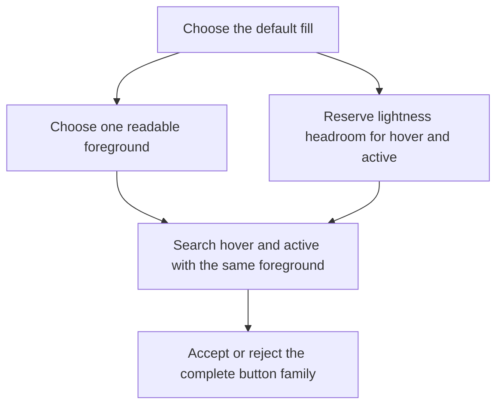

# Filled-action state direction experiment

> Historical research. The completed successor and operator review were adopted
> by [ADR-0004](../adr/0004-mode-relative-filled-actions-and-contextual-separation.md)
> as production policy v16. Earlier infeasibility results remain unchanged.

> Disposition: **do not retain this as the final design direction.** Policy v15
> still implements the experiment while its replacement is designed. This note
> preserves why the experiment mattered, why it is not being promoted, and what
> the next comparison must establish.

## What was tested

Primary and Destructive were made to share two rules in each mode:

1. one black-or-white foreground is selected for both button families;
2. default → hover → active moves toward lower OKLCH lightness in both Light and
   Dark.

The implementation asks the complete three-state family to remain readable
with that foreground. The fixed 216-input RGB corpus generated without a
Primary/Destructive direction or foreground mismatch after policy v15.

An earlier diagnostic also tried making Dark Destructive states lighter while
retaining the selected white foreground and the then-current candidate search.
Within that bounded probe, 41 of 216 hover families and all 216 active families
had no eligible candidate. This explains why simply reversing one direction
flag was not a viable patch. It does **not** prove that Dark interactions should
always darken.

## Why the result is still useful

The experiment exposed a coupled decision that had previously looked like
three independent styling choices:



State direction cannot be chosen responsibly without also considering the
default fill, foreground polarity, gamut-mapped candidates, and the amount of
remaining state headroom. The failed lighter-state probe therefore remains
valuable evidence about the current search envelope.

## Why it is not the intended final design

The default state is the dominant visual state: it is what a user sees before
hovering or pressing the button and for most of the button's lifetime. The
default fill must therefore be selected for visual naturalness before state
movement is optimized.

The current design review identified two connected problems:

- Light output feels broadly too muted or muddy.
- Dark output feels broadly too bright.
- Requiring both modes to preserve room for progressively darker states can
  push default fills toward values that serve the state search better than the
  resting composition.

These are explicit product-design observations, not conclusions measured by
APCA, Oklab distance, the semantic model, or the 216-input corpus. Automated
checks can establish contrast, distance, and generation feasibility; they do
not establish that a resting button looks natural.

## External patterns do not establish one universal direction

- [Spectrum's color guidance](https://spectrum.adobe.com/page/using-color/)
  distinguishes theme-specific colors, which darken in Light and lighten in
  Dark, from static colors, which darken in either theme.
- [Carbon's color overview](https://carbondesignsystem.com/elements/color/overview/)
  describes interaction movement relative to the base tone: darker colors tend
  to get lighter and lighter colors tend to get darker.
- [Material's state guidance](https://m3.material.io/foundations/interaction/states/overview)
  uses state layers and indicators rather than making one lightness direction
  the universal interaction rule.

These references establish that ordered feedback is common, but not that
“always darker” is a general standard or the best fit for this palette.

## Replacement design principles

The next policy experiment must start from these rules:

1. **Default first.** Judge and select the resting Primary and Destructive fills
   before optimizing their interaction progression.
2. **One foreground per mode.** Primary and Destructive should continue to share
   the mode's filled-action foreground unless a later design decision explicitly
   rejects that requirement.
3. **Mode coherence, not forced numerical symmetry.** Light and Dark should feel
   like the same system, but they do not have to move in the same numerical
   lightness direction.
4. **Family feasibility is transactional.** Default, hover, active, and the
   shared foreground must still be accepted as one family; infeasible state
   movement cannot be hidden after choosing an attractive default.
5. **Human comparison owns visual preference.** The first review question is
   whether the default state looks natural. Contract and diagnostic results are
   supporting evidence, not the preference verdict.

The leading hypothesis is Light darker / Dark lighter, or a state-layer
alternative, with enough default-fill and foreground headroom designed into the
family search. It is a hypothesis to compare, not an adopted rule.

## Required next comparison

Compare the current both-darker arm against one preregistered mode-relative arm
using the same inputs and complete family constraints. Review, in this order:

1. side-by-side default-state visual judgment in Light and Dark;
2. shared foreground and APCA feasibility across every state;
3. generation failures and named contract/review transitions;
4. realized OKLCH lightness/chroma and source-distance movement;
5. hover/active ordering and perceptibility.

Do not promote the replacement solely because it passes the automated grid.
Conversely, do not retain both-darker solely because it is currently easier to
generate.

### Locked next probe: bounded joint Dark transaction

The next implementation is deliberately smaller than a new production policy.
It asks whether the existing candidate inventories can form a complete Dark
tuple when the state direction is lighter:

```text
{
  shared foreground,
  Primary default + hover + active,
  Destructive default + hover + active
}
```

“Destructive first” describes the design anchor, not a sequential algorithm.
Destructive must remain separated from the selected Primary, so the two
families are enumerated and checked as one bounded transaction. Defaults are
enumerated first, states are derived with the same foreground, and an
incomplete family is rejected atomically.

The probe is fixed as follows:

- Light remains the current v15 search and is not reselected.
- Every Dark input uses direction `+1`; source hue does not select a branch.
- Primary and Destructive use their current L ranges, steps, chroma/hue
  construction, gamut mapping, constraints, and state targets.
- the foreground inventory is exactly black and white;
- no red-band branch, failure-triggered retry, fallback, widened range, or
  relaxed constraint is allowed;
- eligible tuples are ordered by current Primary source fidelity, then current
  Destructive semantic-anchor distance, then the existing shared-text contrast
  preference, then stable rendered-color identity.

The first viability run covers the 15 known transactional failures plus one
ordinary non-red control. It may establish only whether a complete local tuple
exists inside the frozen inventory. If viable, the same uniform producer can
be wrapped in a 216-input, downstream-complete report. Aesthetic naturalness
remains a later human judgment; `216 / 216` would establish bounded corpus
feasibility, not visual superiority or automatic policy adoption.

#### Viability result

The bounded joint inspector finds a complete tuple for the ordinary blue
control `#3366CC`, proving the enumeration itself is live. Among the 15 inputs
that the prior sequential transaction could not generate, it recovers only
three: `#660000`, `#990033`, and `#993333`. The remaining 12 still have no
eligible tuple after every current Dark Primary lightness request is combined
with both black and white foregrounds and the current Destructive inventory.

This is enough to stop before building a 216-input joint-arm report. The local
inspector recovers three previously missing family tuples, but it does **not**
establish a 204-input full-result arm: the uniform joint strategy has not been
rerun through pair selection and downstream generation for all 216 inputs. It
already proves that at least 12 inputs remain locally infeasible, so the frozen
inventory cannot make the hue-independent grammar corpus-complete. The result
does not authorize widening ranges or relaxing Primary↔Destructive separation
inside the same experiment. Those are separate hypotheses.

The probe removes source-hue branching only from **state direction**. It
intentionally retains the current input-relative Destructive semantic-anchor
preference and the Primary↔Destructive separation constraint; removing either
would be a different intervention.

#### Failure decomposition and ontology finding

The 12 remaining inputs fail at one exact intersection rather than twelve
unrelated edge cases.

| Ordered stage | Repeated conditional evidence |
| --- | ---: |
| black-foreground Dark Primary attempts | `204`, all Primary-family infeasible |
| white-foreground Primary families reaching Destructive | `165` |
| Destructive default candidate occurrences | `5,445` |
| default candidates passing label + Primary separation | `1,052` |
| default candidates with a complete lighter Hover | `126` |
| default candidates with a complete lighter Active | `0` |

Those 1,052 base-passing defaults produce 84,160 repeated Active candidate
occurrences. None passes both state constraints. Exact rejected patterns are:

- `7,843` fail only `state.minimum-separation`;
- `56,999` reach the requested distance but fail only `state.shared-label`;
- `19,318` fail both.

This is repeated candidate-search evidence, not a count of unique colors or
independent observations.

As an executable disconfirming probe, the same producer removes only
`destructive.brand-separation`; tests prove that the rendered candidate
inventory and label-constraint evidence are otherwise identical. This leaves
exactly 13 complete white-foreground, Dark-lighter Destructive families
(`requested L 0.56–0.62`). Their exact default/hover/active identities and each
failed input's maximum Primary distance are pinned in
`test/v2-filled-action-joint.test.js`. For every remaining red input, the
greatest distance between one of those complete families and an eligible
Primary is still below the current `0.08` threshold (approximately
`0.06895–0.07991`).

The empty intersection is conditional on the frozen v15 search: sRGB gamut
mapping and rendered-hex deduplication; Dark Primary
`L 0.58–0.62 / step 0.0025`; Dark Destructive
`L 0.56–0.72 / step 0.005`; an eligible complete Primary family; white
`|Lc| >= 60`; lighter states; Active `ΔE >= 0.075`; and the 80-candidate state
bound. Within those conditions:

```text
one shared white foreground
+ Active distance ΔE >= 0.075
+ Primary↔Destructive distance ΔE >= 0.08
```

The implementation is behaving correctly under the declared v15 policy and
frozen inventory: it does not hide the empty set with a fallback. The ontology
finding is a scope tension and ownership question, not proof of an ontology
defect. Semantic role identity is always required, but numerical fill separation
is currently imposed by the context-free palette even though the accepted
single-filled action hierarchy prevents two filled roles from coexisting in an
action group. Production keeps the conservative separation constraint for now.
A later policy experiment must decide whether it remains a palette-generation
obligation or becomes presentation-context evidence; this diagnostic does not
make that decision.

## Current implementation slice

The first executable slice is a diagnostic-only feasibility census, not a
policy candidate:

- current arm: Light `-1`, Dark `-1` lightness direction;
- mode-relative arm: Light `-1`, Dark `+1`;
- same Primary/Destructive candidate inventories, foreground transaction,
  separation targets, ranking, pair selection, contracts, and reviews;
- fixed 216-input corpus with every typed candidate-exhaustion event retained;
- no fallback, state-layer substitution, default-fill retuning, or production
  cache/policy mutation.

Success means the report deterministically accounts for all inputs and exposes
whether a complete mode-relative family can be generated. It does not mean the
alternative is visually better. If the arm is broadly infeasible, the next
slice must redesign default-fill/headroom search before any human A/B review.

### Reviewed result

The initial direction-only run generated **0 complete mode-relative results**.
All 216 inputs exhausted the Dark Destructive state search: 41 at
`dark.destructive.hover` and 175 at `dark.destructive.active`. This established
that reversing the state direction after selecting the current default cannot
work.

The follow-up transactional arm keeps the same range, constraints, foreground,
and ranking but selects a Dark Destructive default only from candidates that can
also complete lighter hover and active states. It generates **201 of 216**
inputs. The remaining 15 fail at `dark.destructive`; they are concentrated in
red and red-adjacent inputs where Primary separation, shared white text, and
complete lighter-state headroom cannot all be satisfied.

Across the 201 common-support inputs, mean Dark Destructive lightness moves from
`0.64101` to `0.61831`; mean Dark Primary lightness moves from `0.60556` to
`0.59323`. This is directionally consistent with the design observation that
the Dark defaults are too bright, but it is a measured-coordinate change rather
than proof that the candidate looks better. The report digest is
`10100bed0e88961c41453548fcc8e917943e34237529494703393f7736a139d9`.

The next boundary is therefore narrower. A pre-generation hybrid diagnostic now
keeps the entire 41-input source-red collision cohort on v15 and uses the
mode-relative transaction for the 175-input complement. It generates 216/216,
with no new generated-contract, pair-eligibility, semantic-model, or shared-
foreground regression. Nine non-red inputs retain new source-fidelity warnings
and are queued for direct visual review. The exact proposed branch and open
ledger are recorded in
[ADR-0001](../adr/0001-source-red-collision-aware-filled-action-direction.md).

### Adoption audit

The fixed-corpus adoption audit keeps the candidate arm **unadopted**:

- `201 / 216` inputs generate; `15 / 216` (`6.94%`) fail at
  `dark.destructive`.
- Among the 201 generated inputs, no new generated-contract failure, pair
  eligibility miss, semantic-model regression, or Primary/Destructive
  foreground mismatch appears.
- Nine generated inputs introduce both `review.dark.source-fidelity` and the
  corresponding `largeBrandShift` flag:
  `#00CCFF`, `#33CCCC`, `#33CCFF`, `#66CC99`, `#66CCCC`, `#99CC00`,
  `#99CC33`, `#99CC66`, and `#99CC99`.

The first item is a complete-generation blocker and the third is a named
selected-result-review regression. Therefore this arm alone does not satisfy
the precondition for an **Accepted** production ADR or fixed interaction rule.
The later hybrid proposal accounts for the red-band failures by choosing a
declared branch before generation, while leaving the nine source-fidelity
warnings visible for human disposition. It remains Proposed rather than current
production authority.

## Nonclaims

- The 216-input corpus is deterministic coverage, not preference research.
- “Muddy” and “too bright” are current design-review findings, not calibrated
  metric categories.
- The earlier Dark-lighter failures apply to the tested search and foreground
  envelope; they are not a law about dark-mode interaction.
- This historical disposition did not itself revert policy v15. The completed
  successor was later implemented and adopted as policy v16 by ADR-0004.
