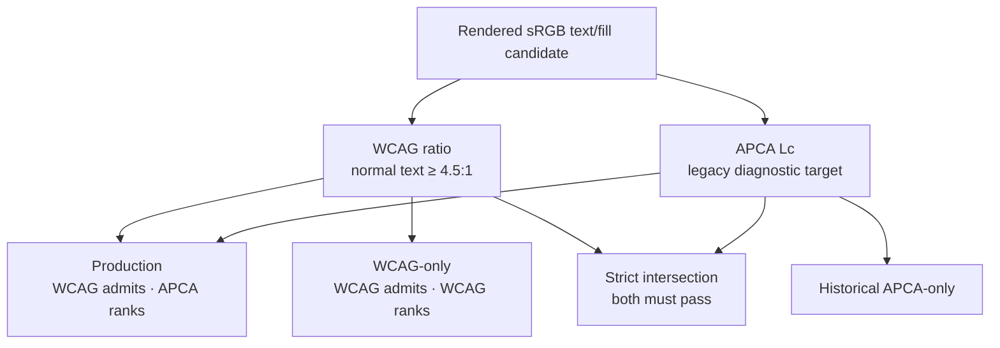

# Text contrast policy counterfactual

> Status: **Diagnostic result supporting ADR-0005.** The report does not own
> production authority. Production policy v17 uses WCAG normal-text eligibility
> and APCA diagnostic ranking.

## Question

Which text eligibility rule can the current bounded candidate inventories
actually satisfy without changing role ranges, state direction, pair selection,
or presentation policy?



No average or weighted eligibility score is used. Production first removes
every candidate below WCAG `4.5:1`, then uses weakest APCA score only to order
the survivors. The strict intersection requires both independent thresholds.

## Fixed intervention

`text-contrast-policy-counterfactual.v2` compares four arms over the same final
sRGB boundary and all other current machinery:

- `wcag-eligible-apca-ranked`: exact production v17 baseline;
- `apca-only`: preserved v16-style eligibility and APCA ranking;
- `wcag-only`: WCAG eligibility and WCAG ranking;
- `intersection`: both eligibility checks and APCA ranking.

Only the production arm must reproduce current output after diagnostic metadata
is removed. Historical APCA-only is now expected to differ.

## Fixed 14-input result

Run:

```sh
npm run diagnose:text-contrast > text-contrast.json
```

| Arm          | Generated | Generated contracts pass | Reference compatible | Changed inputs |
| ------------ | --------: | -----------------------: | -------------------: | -------------: |
| Production   |     14/14 |                    14/14 |                14/14 |              0 |
| APCA-only    |     14/14 |                     0/14 |                 0/14 |             14 |
| WCAG-only    |     14/14 |                    14/14 |                14/14 |              0 |
| Intersection |      0/14 |                        — |                    — |              — |

Under production v19, the strict intersection stops at `dark.primary` for all
14 inputs. Before the Light Warning migration, one input reached and stopped at
`light.warning`; the brighter eligible Light family now lets that path continue
until the same downstream Dark Primary boundary. Total generation remains
`0/14`, so this is pipeline-exit reattribution rather than an added failure.
Candidate-occurrence counts in the JSON report are
repeated evaluations inside a bounded search, not unique colors, population
frequencies, or causal weights.

Production and WCAG-only happen to select the same output on this corpus. That
does not prove APCA ranking is universally redundant; a larger corpus may
contain two WCAG-eligible foregrounds whose ranking differs.

## 216-input migration preflight

Before production authority changed, the existing 216-input diagnostic grid was
generated with WCAG eligibility. All `216/216` inputs generated and there were
no candidate-exhaustion failures. This was a migration falsifier, not a visual
quality study, and therefore did not replace browser review.

## Interpretation

The result supports WCAG eligibility with APCA ranking and rejects only the
narrow claim that the current inventory can require strict APCA∩WCAG without
another policy change. It does not show that the metrics are universally
incompatible or authorize weakening either threshold. The authority decision,
retired claims, and Role × Mode × Context × State scan are recorded in
[ADR-0005](../adr/0005-wcag-normal-text-generation-authority.md).

## Nonclaims

- Passing generation is not accessibility certification or aesthetic quality.
- APCA-only is not perceptually superior because it meets its own heuristic.
- The failed intersection does not identify one threshold as the sole cause.
- The fixed corpus does not represent all possible colors, type rendering, or
  product contexts.
