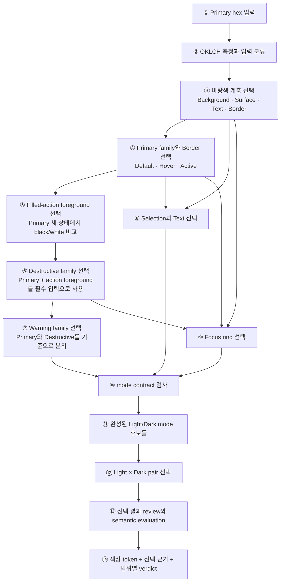
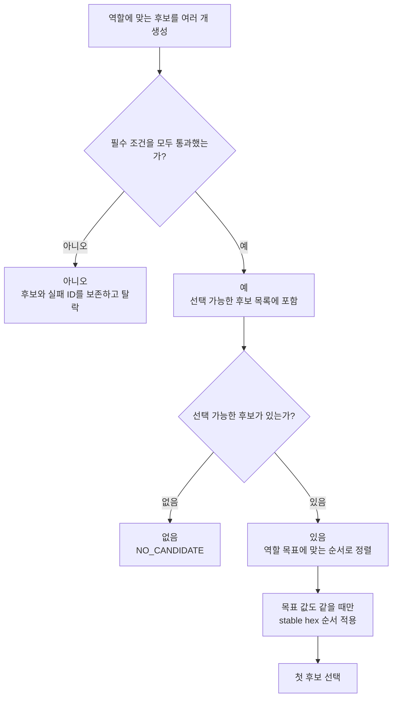
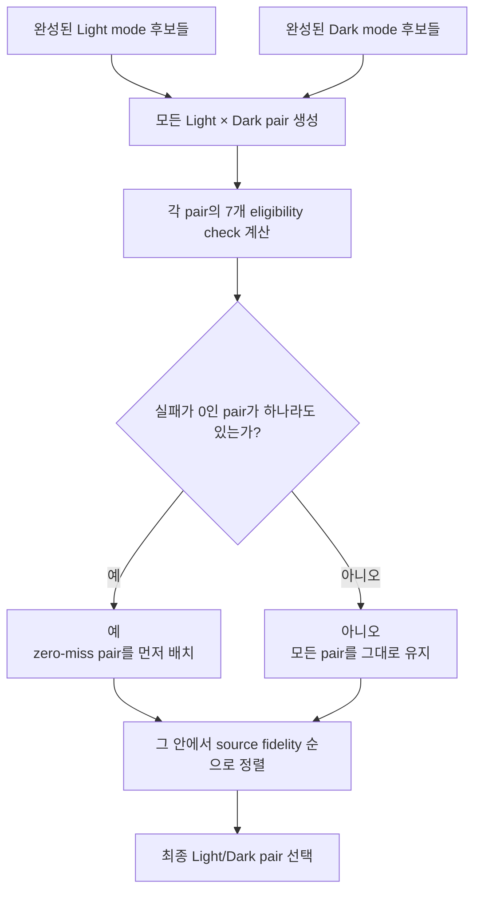
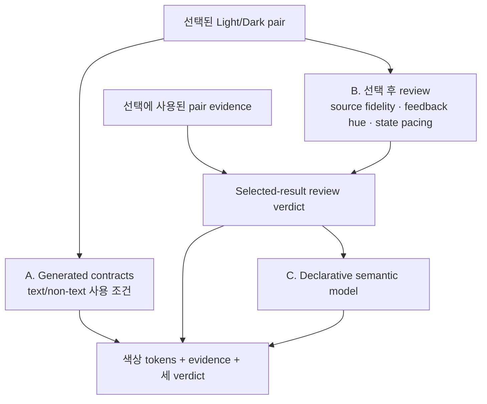

# Primary 입력에서 최종 팔레트까지

> Status: **Human-readable decision walkthrough.** 정확한 실행 정본은 `v2/lib/`와
> `V2_POLICY`다. 이 문서는 색상 생성 과정을 처음부터 끝까지 한 번에 이해하기 위한
> 설명이며 수치 공식이나 candidate loop를 복제하지 않는다.

이 문서는 사용자가 Primary hex 하나를 입력한 뒤 어떤 색이 어떤 순서로 선택되고,
앞에서 선택한 색이 다음 선택에 어떻게 사용되는지를 설명한다. 프로젝트의 개념부터
보고 싶다면 먼저 [Ontology](ontology.md)를 읽어도 되지만, 이 문서만 순서대로 읽어도
전체 생성 과정을 따라갈 수 있다.

현재 설명은 result schema `3`, policy `v2-policy-model-20`, semantic model
`v2-declarative-design@5`, pair strategy
`zero-primary-pair-quality-miss-gated-source-first`에 맞춰져 있다.
[ADR-0005](adr/0005-wcag-normal-text-generation-authority.md)는 text 권위 변경을
소유한다.

문장에 등장하는 임계값·범위·간격의 근거와 권위는
[Numeric policy provenance](policy/evidence.md#numeric-policy-provenance)에서 찾을 수
있다. 외부 표준에 직접 근거하지 않은 숫자는 그 표에서 `product-policy`,
`provisional`, `heuristic`, `technical` 중 무엇인지와 함께 명시한다.

## 30초 요약

Light와 Dark에서 아래 과정을 각각 여러 번 실행해 완성된 mode 후보를 만든다. 그런
다음 Light 후보와 Dark 후보를 조합해 최종 한 쌍을 고른다.

가장 중요한 의존 관계는 다음과 같다.

- Destructive는 선택된 Primary와의 거리를 생성 후에 반드시 기록한다.
- Warning은 선택된 Primary와 Destructive 양쪽과 구분되어야 한다.
- Focus는 Background·Surface뿐 아니라 Primary와 Destructive도 고려한다.
- Light와 Dark는 각자 완성된 뒤에도 pair 관계를 다시 검사한다.

## 모든 역할에서 반복되는 작은 선택 엔진

Foundation, Primary, Destructive처럼 “검색되는 역할”은 서로 다른 색 후보를 만들지만
고르는 방식은 같다.

용어는 다음처럼 읽으면 된다.

- **constraint:** 이 후보를 사용해도 되는가?
- **objective:** 사용할 수 있는 후보 중 무엇을 먼저 고르는가?
- **tie-breaker:** objective까지 같을 때 결과를 어떻게 재현 가능하게 만드는가?
- **review/declaration:** 이미 선택된 결과에 어떤 관찰을 붙이는가?

Constraint를 통과하지 못한 후보는 objective 경쟁에 참여하지 않는다.
`NO_CANDIDATE`는 미적 실패가 아니라 이름 붙은 decision의 필수 조건을 만족하는
후보가 없다는 생성 실패다.

## 1. 입력 Primary를 측정한다

사용자가 입력한 hex는 두 가지로 사용된다.

1. 변경하지 않은 **brand source**로 보존한다.
2. 실제 filled action에 사용할 **generated Primary**를 찾는 기준으로 사용한다.

입력은 OKLCH로 측정하고 chroma `C`에 따라 다음처럼 분류한다. OKLCH `C`는 HSV의
saturation 퍼센트가 아니라 무채색 축에서 떨어진 정도다.

| Classification |           현재 경계 | 뜻                                                  | 생성 과정에서 실제로 달라지는 점                                                                                   |
| -------------- | ------------------: | --------------------------------------------------- | ------------------------------------------------------------------------------------------------------------------ |
| `achromatic`   |         `C < 0.015` | hue를 안정적으로 사용할 수 없는 검정·흰색·회색 계열 | `brandChroma=0`; Foundation tint를 만들지 않음; source-red-band 판단에서 제외                                      |
| `subdued`      | `0.015 <= C < 0.06` | hue는 있지만 낮은 chroma를 가진 muted color         | 입력 hue와 낮은 chroma를 그대로 사용                                                                               |
| `chromatic`    |         `C >= 0.06` | hue가 분명한 색                                     | 입력 hue를 사용하고 Primary chroma는 최대 [`C 0.15`](policy/roles.md#why-primary-chroma-is-capped-at-c-015)로 제한 |

중요하게도 현재 `subdued`와 `chromatic`은 **서로 다른 생성 알고리즘을 선택하지
않는다**. 둘 다 non-achromatic 경로에서 입력 hue와 bounded chroma를 사용한다.
두 결과의 차이는 주로 실제 입력 `C` 값과
[Primary의 `C 0.15` 상한](policy/roles.md#why-primary-chroma-is-capped-at-c-015)에서
나온다.
`C 0.06` 경계는 현재 입력 특성 설명과 diagnostic cohort 구분에 가깝다.

반면 `achromatic` 경계는 실제 생성 분기다. 의미가 불안정한 hue를 사용하지 않도록
Primary chroma와 Foundation tint를 0으로 만든다. Semantic hue review는 이 label을
그대로 신뢰하지 않고 최종 생성색의 실제 chroma를 별도 기준으로 다시 확인한다.

[`0.015`와 `0.06`](policy/evidence.md#input-classification-and-search-resolution)은
현재 runtime 분류 경계이지 경험적으로 검증된 지각 표준은 아니다.

다음 단계로 전달되는 값은 source hex, 측정된 OKLCH와 classification이다.

## 2. 먼저 화면의 바탕 계층을 만든다

Primary가 놓일 환경을 먼저 알아야 text와 boundary contrast를 계산할 수 있기 때문에
Foundation을 먼저 선택한다.

선택하는 역할은 Background, Surface, Raised/Muted Surface, Foreground, Muted Text,
Decorative Border와 Input Border다.

Foundation 후보는 mode recipe의 목표 lightness 주변에서 만든다. 일반 후보는 목표
`L ± 0.04`를 `0.005` 간격으로 탐색하며, 무채색·절반 tint·의도한 tint를 sRGB로
변환한 뒤 같은 hex는 제거한다. Text는 더 넓은 `±0.08`, Input Border는 `±0.10`
범위를 사용한다. 이 탐색 해상도와 반경은 외부 표준이 아니라
[bounded inventory를 위한 기술·제품 상수](policy/evidence.md#input-classification-and-search-resolution)다.

### `foundation.mode-zone`: Background가 mode의 끝 영역에 있는가?

- **적용 대상:** 가장 먼저 선택하는 Background 후보.
- **측정값:** gamut mapping 후 후보의 실제 OKLCH lightness `L`.
- **통과 기준:** Light는 `L >= 0.96`, Dark는 `L <= 0.185`.
- **실패 효과:** 해당 Background 후보만 탈락한다.
- **이유:** Light의 바탕이 너무 어두워지거나 Dark의 바탕이 너무 밝아져 두 mode의
  기본 구조가 뒤집히는 것을 막는다.
- **Authority:** `product-policy`.

정확한 mode zone, hierarchy, text, tint 수치의 근거 수준은
[Foundations and supporting roles](policy/evidence.md#foundations-and-supporting-roles)와
[Accessibility-linked values](policy/evidence.md#accessibility-linked-values)를 함께 본다.

Dark의 `0.185`는 Dark Background recipe `0.145`에 일반 Foundation 후보 반경
`0.04`를 더한 탐색 상한이다. 요청 좌표가 아니라 gamut mapping 후 다시 측정한 실제
`L`에 적용하므로, 변환 과정에서 상한을 넘어간 후보도 제외한다. 이전 `0.22`는 현재
후보 집합을 하나도 걸러내지 못해 이 경계를 표현하지 못했다.

예를 들어 Light Background 후보가 `L 0.955`라면 recipe에 가깝더라도 이 constraint를
통과하지 못하므로 선택 대상이 아니다.

### `foundation.hierarchy`: 인접 surface 사이의 밝기 순서가 보이는가?

- **적용 대상:** Surface, Raised Surface, Muted Surface와 decorative Border.
- **측정값:** 바로 앞에서 선택한 기준 surface와 후보 사이의 OKLCH `ΔL`.
- **통과 기준:** 의도한 방향으로 최소 `ΔL 0.01`; floating-point 경계 허용치는
  `0.001`이다.
- **실패 효과:** 밝기 순서가 틀리거나 간격이 너무 작은 후보가 탈락한다.
- **Authority:** `product-policy`.

관계는 mode별로 다음과 같다.

| 선택 대상         | Light                      | Dark                     |
| ----------------- | -------------------------- | ------------------------ |
| Surface           | Background보다 어두워야 함 | Background보다 밝아야 함 |
| Raised Surface    | Surface보다 밝아야 함      | Surface보다 밝아야 함    |
| Muted Surface     | Surface보다 어두워야 함    | Surface보다 밝아야 함    |
| Decorative Border | Surface보다 어두워야 함    | Surface보다 밝아야 함    |

이 규칙은 “전체 Foundation을 한 번에 정렬”하지 않는다. Background를 먼저 고르고,
그 결과를 기준으로 Surface를 고르는 식으로 앞 단계의 선택값을 다음 단계가 사용한다.

### `foundation.text-contrast`: 가장 불리한 배경에서도 읽히는가?

- **적용 대상:** Foreground와 Muted Text 후보.
- **사용 맥락:** 공개 specimen 기준 Body `11px/400`, Muted UI `9px/400`이며
  둘 다 WCAG normal text로 선언한다.
- **측정값:** 후보 text와 해당 text가 놓일 모든 최종 sRGB 배경 사이 WCAG
  contrast ratio의 최솟값.
- **통과 기준:** 모든 조합에서 최소 `4.5:1`.
- **실패 효과:** 배경 하나에서라도 목표 아래면 후보가 탈락한다.
- **Authority:** `normative`; 선언한 normal-text 용도의 WCAG 2.2 Contrast Minimum.

평균이 아니라 **가장 약한 조합**을 사용한다. APCA `Lc 75/60`은 같은 후보들의
순위를 정하고 결과를 진단하는 legacy heuristic으로 기록되지만 탈락 권위는 없다.

### `foundation.boundary-contrast`: Input Border가 Surface에서 보이는가?

- **적용 대상:** Input Border 후보만 해당한다. Decorative Border에는 이 `3:1`
  의무를 적용하지 않는다.
- **측정값:** 후보 Input Border와 이미 선택한 Surface의 WCAG contrast ratio.
- **통과 기준:** 최소 `3:1`.
- **실패 효과:** 조건을 만족하지 않는 Input Border 후보가 탈락한다.
- **이유:** Input Border는 장식이 아니라 control의 경계를 전달하는 non-text UI
  component이기 때문이다.
- **Authority:** `normative`; WCAG Non-text Contrast 근거.

### `foundation.calm-tint`: Foundation이 너무 유채색이 되지 않는가?

- **적용 대상:** 모든 Foundation 후보.
- **측정값:** sRGB 변환 후 후보의 실제 OKLCH chroma `C`.
- **통과 기준:** `C <= 0.012`; 변환 경계 허용치 `0.0005`.
- **실패 효과:** tint가 과도한 후보가 탈락한다.
- **입력 분류와의 관계:** `achromatic` 입력은 tint를 항상 `0`으로 만든다.
  `subdued`와 `chromatic` 입력만 source hue를 사용한 약한 tint 후보를 만든다.
- **Authority:** `provisional`.

이 constraint는 Foundation을 완전한 회색으로 강제하지 않는다. 입력 hue의 흔적을
허용하되 화면 대부분을 차지하는 바탕이 brand color처럼 강해지는 것을 제한한다.

### `foundation.recipe-fidelity`: 통과 후보 중 어느 것을 고르는가?

위 규칙들은 사용할 수 없는 후보를 제거한다. 남은 후보는 mode recipe가 의도한
목표색과의 Oklab 거리가 작은 순서로 정렬하고 첫 후보를 선택한다.
`foundation.recipe-fidelity`는 constraint가 아니라 `product-policy` objective이므로,
필수 조건을 실패한 후보를 되살릴 수 없다.

여기서 선택한 Background와 Surface는 이후 Primary Border, Selection, Focus와 mode
contract의 기준면이 된다.

## 3. generated Primary family를 고른다

이제 source hue를 유지하면서 mode에 맞는 여러 lightness 후보를 만든다. Source
chroma는 calm/minimal cap 안에서만 Primary 후보에 사용한다.

Primary range, state ΔE, source-distance review와 Light/Dark pair band는
[Primary, states, and Light/Dark pairing](policy/evidence.md#primary-states-and-lightdark-pairing)에
각 숫자의 근거와 잠정성이 정리되어 있다.

Primary family 후보 하나는 default fill만 뜻하지 않는다. 다음 묶음이 모두
만들어져야 하나의 family 후보가 된다.

- default Primary
- hover와 active
- 세 상태에서 함께 읽히는 black 또는 white text

| 검사 순서 | 질문                                             | Rule ID                    |
| --------- | ------------------------------------------------ | -------------------------- |
| 1         | hover·active와 shared text까지 완성 가능한가?    | `primary.generated-family` |
| 2         | 현재 Light/Dark mode의 허용 lightness 범위인가?  | `primary.mode-range`       |
| 3         | calm/minimal chroma bound 안에 있는가?           | `primary.calm-chroma`      |
| 4         | 하나의 text가 default·hover·active에서 읽히는가? | `primary.shared-label`     |

모두 통과한 family 중 원래 source와 Oklab 거리가 가장 가까운 후보를
`primary.source-fidelity`로 고른다.

Primary가 선택되면 별도 후보 검색으로 Background와 Surface에서 보이는 Primary
Border를 고른다. `primary-border.adjacent-contrast`를 통과한 후보 중 Primary와 가장
가까운 후보를 `primary-border.minimum-brand-distance`로 선택한다.

이 단계의 결과가 다음 선택의 기준이 된다.

- Destructive는 이 Primary와 구분되어야 한다.
- Warning도 이 Primary와 구분되어야 한다.
- Selection tint와 Focus는 이 Primary의 hue family를 참고한다.

## 4. 공통 filled-action text를 정한 뒤 Destructive family를 고른다

Primary default·hover·active가 정해지면 엔진은 black과 white 중 세 fill 모두에서
WCAG `4.5:1`을 통과하는 후보만 남긴다. 둘 다 통과하면 가장 약한 APCA 진단 점수가
큰 하나를 **이 mode의 filled-action foreground**로 확정한다. 공개 specimen의
action label은 `11px/650` normal text다. 이 선택은 Primary 전용 사후 장식이
아니며 다음 Destructive 검색이 반드시 사용하는 입력이다.

Destructive는 입력 Primary에서 파생한 색이 아니라 semantic red 역할이다. Production
기본 hue는 27°이며, bounded lightness 후보를 만든다. Source가 red 영역에 가까운지는
preferred lightness anchor에만 영향을 준다.

### 왜 Primary와 달라야 하는가?

Primary는 일반적인 대표 행동이고 Destructive는 삭제·제거처럼 되돌리기 어렵거나
위험한 행동이다. 두 역할이 같은 화면에 함께 있을 때 거의 같은 색이면, 색이라는
신호가 행동 성격의 차이를 전달하지 못하고 label과 배치에만 의존하게 된다. 따라서
이 정책은 Destructive를 고를 때 이미 선택된 Primary를 비교 기준으로 사용한다.

이 의미적 의도는 policy v16에서 `destructive.brand-separation`이라는
**selected-result review**로 구현된다. 최종 sRGB 색의 Oklab `ΔE`가
`0.08` 이상인지 검사하지만, 미달 후보를 생성 단계에서 제거하지는 않는다.
통과는 **선언된 수치 관계가 유지됨**을 뜻할 뿐, 사람이 차이를 충분히 지각하거나
Destructive를 위험 의미로 해석한다는 증거는 아니다. 선택 후의 30° hue review도
같은 한계를 갖는 별도 provisional signal이다.

`27°`, chroma, lightness range와 separation 값은
[Feedback and semantic review](policy/evidence.md#feedback-and-semantic-review)의
bounded product recipe이며, 보편적인 semantic-red 표준이 아니다.

### 왜 Dark↑ 공동 탐색이 일부 red 입력에서 끝까지 실패하는가?

진단은 이 실패를 단순한 “red 후보 부족”보다 좁게 분해했다. 남은 12개 입력에서
black foreground를 사용한 Dark Primary 시도 204개는 모두 Primary family 단계에서
탈락했다. White foreground로 살아남은 165개 Primary family에 대해 Destructive
후보 5,445개를 평가했고, 그중 1,052개는 default label 대비와
`destructive.brand-separation`을 통과했다. Hover family는 126개가 가능했지만 Active
family는 0개였다.

Active state 후보 occurrence 84,160개에서 다음 두 constraint를 동시에 통과한 후보가
없었다.

- `state.minimum-separation`: default에서 Oklab `ΔE >= 0.075`;
- `state.shared-label`: 더 밝아진 state에서도 white foreground `|Lc| >= 60`.

실행 가능한 반증 probe는 producer에서 `destructive.brand-separation` 하나만 제외하고
같은 후보와 나머지 constraint를 다시 평가한다. 그 결과 white foreground와 밝아지는
상태를 완성하는 default가 정확히 13개(`requested L 0.56–0.62`) 존재한다. 하지만 남은
12개 red 입력에서 이 완전한 Destructive family와 가능한 Primary의 최대 Oklab 거리는
모두 `0.08` 미만(`약 0.06895–0.07991`)이다.

따라서 **이전 v15의 조건 아래에서** 실패는 구현이 후보를 누락한 것이 아니라
**shared foreground + active separation + inter-role separation**의 교집합이 빈 결과다.
여기서 “현재 조건”은 sRGB gamut mapping과 rendered-hex dedupe, Dark Primary
`L 0.58–0.62 / step 0.0025`, Dark Destructive `L 0.56–0.72 / step 0.005`, 완성 가능한
Primary family, white `|Lc| >= 60`, 밝아지는 state 방향, Active `ΔE >= 0.075`, state당
최대 80개 후보를 뜻한다. 후보 범위나 변환·dedupe 규칙을 바꾼 모든 가능한 시스템의
교집합이 비었다는 뜻은 아니다.

이 결과는 현재 구현이 선언된 constraint를 정확히 fail-closed로 집행한다는 강한
근거다. 동시에 `destructive.brand-separation`이 semantic role identity와 실제
simultaneous-filled presentation을 하나의 전역 palette 의무로 근사한다는 ontology의
**책임 범위 긴장**도 드러낸다. 이것만으로 ontology가 잘못되었다고 판정하지는 않는다.
[ADR-0003](adr/0003-single-filled-action-hierarchy.md)은 두
역할이 동시에 filled로 표시되지 않게 한다. Separation을 삭제하거나 component
문맥에 따라 적용하는 변경은 가능한 후속 가설이지만, 이 진단 자체는 production
constraint를 변경하지 않는다. 전체 재현 결과는
[state-direction research](research/filled-action-state-direction.md)에 남긴다.

후속 [contextual separation 진단](research/contextual-destructive-separation.md)은
`destructive.brand-separation`만 generation eligibility에서 제외하고 같은 거리
verdict를 review evidence로 보존했다. 이 조건에서는 fixed 216 입력이 모두 생성되고
generated contract와 pair eligibility의 새 실패가 없었다. 그러나 22개 입력은 실제로
`ΔE 0.08` 미만이어서 semantic relation이 `unsatisfied`로 남았고, Dark source-fidelity
finding 9건이 새로 생겼다. 이것은 generation과 review authority를 분리할 수 있다는
증거이지 `0.08`이 불필요하거나 결과가 미적으로 좋다는 증거가 아니다.

| 검사                           | 질문                                                     |
| ------------------------------ | -------------------------------------------------------- |
| `destructive.label-contrast`   | 앞에서 확정한 filled-action foreground를 읽을 수 있는가? |
| `destructive.brand-separation` | 방금 선택한 Primary와 Oklab 거리가 review 기준을 넘는가? |

통과한 후보 중 현재 semantic lightness anchor에 가장 가까운 후보를
`destructive.semantic-anchor`로 고른다. 이어서 같은 filled-action foreground를
사용할 수 있는 hover·active를 생성한다. 따라서 Destructive가 먼저 색을 고른 뒤
black/white 중 편한 쪽을 별도로 선택하는 순서가 아니다.

Primary와 Destructive는 모두 화면의 채워진 버튼 역할이다. 두 family는 같은 상호작용
문법을 사용한다. Light의 Hover/Active는 점점 어두워지고, Dark의 Hover/Active는
점점 밝아진다. 각
family는 Default·Hover·Active뿐 아니라 서로도 하나의 black/white text를 공유한다.
Light와 Dark mode는 각각 독립적으로 foreground를 정할 수 있지만, 같은 mode 안의
Primary와 Destructive는 서로 다른 polarity를 가질 수 없다.

이것은 production v16의 생성 순서다. Dark Destructive는 default를 먼저
고른 뒤 상태를 붙이는 것이 아니라, 공통 foreground로 lighter hover·active까지
완성할 수 있는 default family만 후보가 된다. 채택 결정과 경고 장부는
[ADR-0004](adr/0004-mode-relative-filled-actions-and-contextual-separation.md)에 남겨져 있다.

따라서 Primary가 바뀌면 같은 red inventory에서도 다른 Destructive가 선택되거나,
극단적인 경우 Destructive를 생성하지 못할 수 있다.

### action group hierarchy와 red-band diagnostic

Palette generation은 Primary와 Destructive visual family를 항상 독립적으로 유지한다.
Component는 source hue가 아니라 action group 문맥으로 emphasis를 정한다.

| 문맥                     | Primary | Destructive | 실행 strategy                         |
| ------------------------ | ------- | ----------- | ------------------------------------- |
| 두 역할이 함께 있음      | filled  | outline     | `primary-filled-destructive-outline`  |
| destructive confirmation | 없음    | filled      | `destructive-filled-secondary-cancel` |

두 번째 문맥의 Cancel은 secondary다. 이 말은 Destructive보다 낮은 강조도를 뜻하며,
반대 상태 방향이나 검증 없는 Foundation alias를 뜻하지 않는다. 실행 authority는
`single-filled-action-hierarchy-v2`다.

Confirmation Cancel은 palette가 모두 완성된 뒤 해당 mode의 Muted Surface와 Foreground를
소비한다. Default는 Muted Surface와 같은 불투명 색이다. 이후 Light는 OKLCH `L`을
낮추고 Dark는 높여 후보를 만든다. 최종 gamut-mapped sRGB에서 Hover는 Default와
Oklab `ΔE ≥ 0.015`, Active는 `ΔE ≥ 0.030`이고 Hover보다 같은 방향으로 더 멀어야 한다.
모든 상태의 `11px/650` normal-text label은 WCAG `4.5:1`을 통과해야 하며, 통과 후보 중
실제 `ΔE`가 가장 작은 것을 고른다. 이 값은 export token이 아니라
`destructive-confirmation` 문맥의 presentation 값이다. 숫자와 실제 예시는
[Secondary action states](../../v2/reference.html#secondary-action-states), 결정 경계는
[ADR-0006](adr/0006-context-derived-secondary-action-states.md)에 있다.

`destructive-anchor.source-band-applicable`은 두 red 역할의 시각 검토 우선순위를 높이는
diagnostic일 뿐 이 표나 Secondary 후보를 바꾸지 않는다. Primary visual-family
reuse를 검토했던 이전 규칙은 [ADR-0002](adr/0002-red-band-role-collision-presentation.md)에
superseded history로 보존한다.

## 5. Warning family를 고른다

Warning은 bounded amber inventory에서 선택한다. 이 시점에는 Primary와 Destructive가
둘 다 결정되어 있다.

Warning의 hue ladder와 chroma·lightness·separation 수치의 authority 역시
[Feedback and semantic review](policy/evidence.md#feedback-and-semantic-review)에
명시되어 있다.

현재 v20은 v19에서 채택한 mode별 recipe를 유지한다. Light는 시각 비교에서 채택한
`L .78 / C .18 / range [.52,.82]`, Dark는 아직 별도 disposition되지 않은
`L .72 / C .14 / range [.62,.80]`이다. 두 mode 모두 anchor `85°`와
`[70°,85°,100°]` 후보를 유지한다. 이 비대칭의 결정 경계와 216-input 근거는
[ADR-0007](adr/0007-light-warning-vivid-amber.md)이 소유한다.

| 검사                           | 질문                                              |
| ------------------------------ | ------------------------------------------------- |
| `feedback.label-contrast`      | Warning label을 읽을 수 있는가?                   |
| `feedback.semantic-separation` | Primary와 Destructive 양쪽에서 충분히 구분되는가? |

통과한 후보 중 amber semantic anchor에 가장 가까운 후보를
`feedback.semantic-anchor`로 고른다. Destructive와 마찬가지로 default·hover·active가
하나의 text를 공유하는 family를 만든다.

이 family의 선택된 Default evidence가 검정/흰색 중 고른 text를 기록한다.
`warningFamilySelection()`은 이를 다시 계산하지 않고 family label로 채택한다.
Hover/Active는 같은 label의 contrast를 검사하고, 최종 Warning Text 단계는 후보를
다시 고르지 않고 그 한 값이 세 fill 모두에서 유효한지만 검증한다. 네 단계 모두
`text.typographyContexts.warningLabel.apcaDiagnosticMinimum`을 읽는다.
Primary의 `apcaDiagnosticLc`는 Warning의 설정이 아니다. 현재 두 값이 우연히 `60`으로
같더라도 서로 독립된 owner를 유지한다. 이 one-label contract와 실패 경계는
[ADR-0008](adr/0008-warning-shared-label-transaction.md)이 소유한다.

최종 Text decision은 policy `fixedTextValidation`을 사용한다. 여기에는
`text.required-contrast` constraint만 있고 objective와 tie-breaker는 없다. 후보가 한
개이므로 “가장 좋은 text를 다시 선택했다”는 순위 주장을 만들지 않는다.

이 때문에 Warning은 Primary뿐 아니라 앞 단계의 Destructive 선택에도 의존한다.

## 6. Selection과 Text를 고른다

Selection은 강한 새 accent를 만들지 않고 source hue를 사용한 저채도 tint를 찾는다.

- `selection.text-contrast`: 선택 영역의 text가 읽혀야 한다.
- `selection.surface-separation`: 주변 Surface와 구분되어야 한다.
- `selection.minimum-emphasis`: 통과 후보 중 필요한 만큼만 강조된 후보를 고른다.

Selection 배경과 Text의 관계는 한 번만 사후 검사하지 않는다.

1. **후보 평가:** 각 Selection 후보에 검정 또는 흰색 text를 임시 배치하고 WCAG
   `4.5:1`인지 계산한다. `selection.text-contrast` 실패
   후보는 선택 전에 탈락한다.
2. **Text 확정:** Selection을 고른 직후 `sharedTextSearch`가 선택된 배경 하나를
   기준으로 실제 `selection text` token을 확정한다. 같은 WCAG target을 쓴다.
3. **mode contract:** mode를 조립한 뒤 최종 Selection/Text 조합을 `Selected
content` WCAG check로 다시 계산한다. 이 check는 `mode.passed`에 포함된다.
4. **semantic evaluation:** `selection-text-target-passes` evaluator는 Light와
   Dark의 최종 `Selected content` evidence를 소비한다. 이 단계는 색을 다시 고르지
   않는다.

따라서 candidate constraint, 실제 Text 결정, 최종 contract, semantic declaration은
같은 관계를 서로 다른 시점에 검증한다. 공개 specimen의 Selection은 `10px/400`
normal text다. APCA `Lc 60`은 진단 메타데이터이며 완전한 접근성 인증을 뜻하지 않는다.

Color alone으로 selected state를 전달하지 않으며 위치·형태 또는 상태 의미가 함께
필요하다.

## 7. Focus ring을 고른다

Focus는 Primary를 그대로 복사하지 않고 독립 후보 검색을 한다.

| 검사                        | 비교 대상                          |
| --------------------------- | ---------------------------------- |
| `focus.adjacent-contrast`   | Background, Surface, Muted Surface |
| `focus.semantic-separation` | Primary와 Destructive control      |
| `focus.brand-relation`      | 입력 Primary의 hue family          |

조건을 통과한 후보 중 Primary와 가장 가까운 후보를
`focus.minimum-brand-distance`로 고른다. UI에서는 ring 주변의 gap도 함께 사용한다.
Muted Surface는 Confirmation footer와 여러 muted component가 실제로 ring과 인접하는
presentation context이므로 production v18부터 후보 eligibility와 최종 mode contract에
포함된다.

## 8. 한 mode가 실제로 사용할 수 있는지 검사한다

지금까지 선택한 역할을 조립해 Light 또는 Dark mode bundle 하나를 만든다. 이때
WCAG normal-text와 required non-text boundary contract를 다시 모아
`mode.passed`를 만든다. 각 text check에는 typography context와 APCA 진단값도 남는다.

이 contract는 “생성한 UI role을 선언된 조건으로 사용할 수 있는가”만 뜻한다. 원본
색 보존, semantic hue나 미적 품질을 뜻하지 않는다.

## 9. 위 과정을 여러 Primary lightness에서 반복한다

엔진은 Light와 Dark 각각에서 Primary range의 baseline, start, midpoint와 end를
bounded sample로 사용한다. 각 Primary sample마다 2~8단계를 다시 실행하므로 후보는
Primary 한 색이 아니라 **완성된 mode bundle**이다.

Rendered Primary가 같은 중복 mode bundle은 제거한다. 생성 도중 어떤 역할에서도
constraint 통과 후보가 0개면 해당 sample은 구조화된 `NO_CANDIDATE`로 기록된다.

## 10. Light와 Dark를 한 쌍으로 고른다

Light mode 후보와 Dark mode 후보의 모든 조합을 만든 뒤 다음 순서로 고른다.

7개 eligibility check는 다음 관계를 본다.

- Light/Dark Primary hue drift
- Light/Dark Primary chroma difference
- Light/Dark Primary lightness gap
- Light Primary state interval ratio와 monotonic lightness
- Dark Primary state interval ratio와 monotonic lightness

Stable ID는 다음과 같다.

- `pair.primary-hue-drift`
- `pair.primary-chroma-difference`
- `pair.primary-lightness-gap`
- `light.primary.state.interval-ratio`
- `light.primary.state.monotonic-lightness`
- `dark.primary.state.interval-ratio`
- `dark.primary.state.monotonic-lightness`

Zero-miss pair가 있으면 그 pair를 먼저 보지만 실패가 있는 pair를 alternatives에서
삭제하지 않는다. Zero-miss pair가 하나도 없으면 complete inventory를 그대로 유지한
전체 목록에서 source distance가 작은 pair를 고른다. 이 전략의 ID는
`zero-primary-pair-quality-miss-gated-source-first`다.

## 11. 선택된 결과를 세 범위로 나누어 검증한다

Pair를 고른 뒤에도 하나의 “전체 품질 점수”를 만들지 않는다.

### A. Generated contracts

선택된 Light와 Dark의 text/non-text mode contract가 모두 통과했는지를 나타낸다.
`result.contractsPassed`와 기존 호환 필드 `result.passed`가 이 값이다.

### B. Selected-result review

Pair 선택에 사용된 evidence를 보존하고 다음을 추가로 검토한다.

- generated Primary가 source에서 크게 이동했는가?
- Primary hue가 Destructive 또는 Warning과 너무 가까운가?
- Primary·Destructive·Warning의 state 간격과 방향이 자연스럽게 진행되는가?

일부 review finding은 generated contract를 실패시키지 않는다. 또한 pair eligibility에
참여한 7개 check와 선택 후에만 보는 review check를 구분한다.

### C. Declarative semantic model

선택된 결과와 review evidence를 사용해 “shared label이 읽히는가”, “state가 서로
다른가”, “active가 hover보다 계속 진행되는가” 같은 이름 붙은 declaration을
평가한다.

Evidence가 없거나 producer가 명시적 boolean verdict를 제공하지 않으면 추측해서
통과시키지 않고 `needs-review`로 남긴다.

| Result field                       | Authority ID                 | 의미                                 |
| ---------------------------------- | ---------------------------- | ------------------------------------ |
| `verdicts.contracts.passed`        | `generated-contracts`        | 선택된 두 mode의 contract 범위       |
| `verdicts.qualityReview.passed`    | `selected-result-review`     | retained pair evidence와 review 범위 |
| `verdicts.semanticModel.satisfied` | `declarative-semantic-model` | 선언된 semantic model 범위           |

이 세 값을 하나로 합쳐 “전체적으로 좋은 팔레트”라고 해석하면 안 된다.

후보 단계에서 WCAG와 APCA를 각각 또는 동시에 적용한 결과는
[Text contrast policy counterfactual](research/text-contrast-policy.md)에 보존한다.
현재 후보군에서 strict APCA∩WCAG intersection은 0/14였으므로 production
eligibility나 UI 토글로 승격되지 않았다. Production은 WCAG 적격성 뒤 APCA
순위화를 사용한다.

## 규칙이 왜 존재하는지 더 읽기

지금까지는 **어떤 순서로 어떻게 작동하는지**를 설명했다. 정확한 수치와 근거의
성격은 다음 문서가 소유한다.

| 더 알고 싶은 것                          | 상세 문서                                                                 | 실행 소유자                  |
| ---------------------------------------- | ------------------------------------------------------------------------- | ---------------------------- |
| 역할별 규칙이 필요한 이유                | [Role policies](policy/roles.md)                                          | `policy.js`, role producer   |
| authority와 provenance 해석              | [Evidence authority](policy/evidence.md)                                  | `evidence-authority.js`      |
| 모든 numeric threshold/range/step의 근거 | [Numeric policy provenance](policy/evidence.md#numeric-policy-provenance) | `policy.js`, role recipes    |
| 정확한 validation 기준                   | [v2 validation policy](../v2-spec.md#validation-policy)                   | `policy.js`, producer checks |
| candidate selection과 trace 구조         | [Candidate search](implementation/candidate-search.md)                    | `decision.js`                |
| semantic declaration 상세                | [Semantic model](policy/semantic-model.md)                                | `semantic-model.js`          |
| 고정 corpus에서 발견한 한계              | [Adversarial audit](research/adversarial-audit.md)                        | diagnostic modules           |

Rule/declaration evidence authority는 `normative`, `product-policy`, `provisional`,
`technical`, `heuristic`, `research-policy`의 닫힌 vocabulary를 사용한다.
`diagnostic`은 실험 범위이며 production rule authority가 아니다.

## Stable rule ID reference

아래 표는 문서와 현재 `V2_POLICY.decisions`가 어긋나지 않도록 유지하는 참고 영역이다.
앞의 설명을 이해하기 위해 먼저 읽을 필요는 없다.

| Decision           | Constraints                                                                                     | Objective                               | Tie-breaker        |
| ------------------ | ----------------------------------------------------------------------------------------------- | --------------------------------------- | ------------------ |
| `state`            | `state.minimum-separation`                                                                      | `state.minimum-change`                  | `stable.hex-order` |
| `labeledState`     | `state.minimum-separation`, `state.shared-label`                                                | `state.minimum-change`                  | `stable.hex-order` |
| `primary`          | `primary.generated-family`, `primary.mode-range`, `primary.calm-chroma`, `primary.shared-label` | `primary.source-fidelity`               | `stable.hex-order` |
| `destructive`      | `destructive.label-contrast` (`destructive.brand-separation`은 v16 selected-result review)      | `destructive.semantic-anchor`           | `stable.hex-order` |
| `foundationAnchor` | `foundation.mode-zone`, `foundation.calm-tint`                                                  | `foundation.recipe-fidelity`            | `stable.hex-order` |
| `foundationLayer`  | `foundation.hierarchy`, `foundation.calm-tint`                                                  | `foundation.recipe-fidelity`            | `stable.hex-order` |
| `foundationText`   | `foundation.text-contrast`, `foundation.calm-tint`                                              | `foundation.recipe-fidelity`            | `stable.hex-order` |
| `foundationInput`  | `foundation.boundary-contrast`, `foundation.calm-tint`                                          | `foundation.recipe-fidelity`            | `stable.hex-order` |
| `binaryText`       | `text.required-contrast`                                                                        | `text.maximize-weakest-contrast`        | `stable.hex-order` |
| `focus`            | `focus.adjacent-contrast`, `focus.semantic-separation`, `focus.brand-relation`                  | `focus.minimum-brand-distance`          | `stable.hex-order` |
| `primaryBorder`    | `primary-border.adjacent-contrast`                                                              | `primary-border.minimum-brand-distance` | `stable.hex-order` |
| `warning`          | `feedback.label-contrast`, `feedback.semantic-separation`                                       | `feedback.semantic-anchor`              | `stable.hex-order` |
| `selection`        | `selection.text-contrast`, `selection.surface-separation`                                       | `selection.minimum-emphasis`            | `stable.hex-order` |

## Semantic declaration reference

모든 declaration은 `declaration → evidence contract → evaluator → acceptance test`로
연결된다.

| Declaration                                 | Kind       | Authority       | Evidence contract                            | Evaluator                                         |
| ------------------------------------------- | ---------- | --------------- | -------------------------------------------- | ------------------------------------------------- |
| `shared-label-readable`                     | constraint | normative       | `evidence.primary-label-wcag.v1`             | `evaluator.primary-label-readable.v1`             |
| `states-distinct`                           | invariant  | technical       | `evidence.primary-exported-states.v1`        | `evaluator.primary-states-distinct.v1`            |
| `active-continues-beyond-hover`             | relation   | research-policy | `evidence.primary-state-progression.v1`      | `evaluator.primary-state-progression.v1`          |
| `foundation-hierarchy-ordered`              | relation   | research-policy | `evidence.foundation-hierarchy-decisions.v1` | `evaluator.foundation-hierarchy.v1`               |
| `foundation-text-targets-pass`              | constraint | normative       | `evidence.foundation-text-wcag.v1`           | `evaluator.foundation-text-targets.v1`            |
| `focus-adjacent-contrast-passes`            | constraint | normative       | `evidence.focus-foundation-contrast.v2`      | `evaluator.focus-adjacent-contrast.v2`            |
| `focus-control-oklab-separation-passes`     | relation   | heuristic       | `evidence.focus-semantic-separation.v1`      | `evaluator.focus-control-oklab-separation.v1`     |
| `feedback-destructive-label-targets-pass`   | constraint | normative       | `evidence.destructive-label-wcag.v1`         | `evaluator.feedback-destructive-label-targets.v1` |
| `feedback-warning-label-targets-pass`       | constraint | normative       | `evidence.warning-label-wcag.v1`             | `evaluator.feedback-warning-label-targets.v1`     |
| `feedback-oklab-separation-passes`          | relation   | heuristic       | `evidence.feedback-oklab-separation.v1`      | `evaluator.feedback-oklab-separation.v1`          |
| `selection-text-target-passes`              | constraint | normative       | `evidence.selection-text-wcag.v1`            | `evaluator.selection-text-target.v1`              |
| `selection-surface-oklab-separation-passes` | relation   | heuristic       | `evidence.selection-surface-separation.v1`   | `evaluator.selection-surface-oklab-separation.v1` |

각 declaration은 positive, contradictory, missing-evidence acceptance scenario를
하나씩 가져야 한다.

## Explicit nonclaims

현재 규칙을 모두 통과해도 다음을 증명하지 않는다.

- 전체 palette의 미적 품질 또는 선호도
- 지각 가능한 hover·focus·semantic meaning의 보편적 보장
- 완전한 WCAG 또는 접근성 인증
- provisional threshold의 경험적 타당성이나 최적성
- fixed diagnostic corpus의 비율을 population prevalence로 일반화
- diagnostic counterfactual의 production 채택

## Maintenance contract

다음 변경은 이 문서의 본문 흐름과 reference를 같은 변경 단위에서 갱신해야 한다.

1. 역할 생성 순서나 dependency가 바뀐다.
2. decision ID 또는 constraint/objective/tie-breaker membership이 바뀐다.
3. pair eligibility, fallback 또는 ranking authority가 바뀐다.
4. generated contract, selected-result review 또는 semantic verdict 경계가 바뀐다.

새 규칙은 stable ID, owner, authority, executable acceptance와 nonclaim을 가져야 한다.
